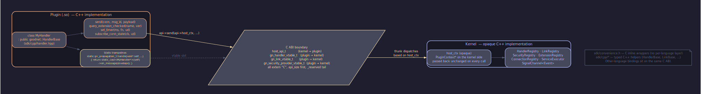

# Bridges Model

Operator-side биндинги — это слой между голым C ABI ядра и
идиоматичным кодом приложения. `sdk/core.h` устроен как стабильная
FFI-плоскость: 36 функций, opaque `gn_core_t*`, каждый возврат —
`gn_result_t`, каждая буферная пара — `(uint8_t*, size_t)`. Биндинг
поднимает эту плоскость до RAII-handle, `std::expected`,
`std::span`, не трогая ABI и не вводя новых концепций. Каждый язык
получает свою пристройку: `bridges/cpp/` уже shipped, `bridges/rust/`
и `bridges/python/` — на roadmap'е.

[`overview`](overview.ru.md) и [`ecosystem`](ecosystem.ru.md)
описывают, где биндинг живёт в семействе единиц. Эта глава — про то,
что он внутри собой представляет: какая разделение ответственности с
plugin-side SDK, как устроены lifetime каждого primitive, на каком
thread бегут callback'и, и какой контракт повторяет автор binding'а
для нового языка.

<!-- livedoc:embed_c_cpp_bridging -->
<!-- generated by tools/livedoc.py — do not edit by hand; rerun `make livedoc` to refresh -->



_C ABI ↔ C++ implementation bridging across the SDK boundary._
<!-- /livedoc:embed_c_cpp_bridging -->


## Содержание

- [Зачем отдельный layer над capi](#зачем-отдельный-layer-над-capi)
- [bridges/cpp vs sdk/cpp](#bridgescpp-vs-sdkcpp)
- [Owned types и lifetime model](#owned-types-и-lifetime-model)
- [Threading model](#threading-model)
- [Error mapping](#error-mapping)
- [`std::expected` discipline](#stdexpected-discipline)
- [Pattern для per-language bindings](#pattern-для-per-language-bindings)
- [Когда app reach for bridges/cpp vs raw capi](#когда-app-reach-for-bridgescpp-vs-raw-capi)
- [Cross-references](#cross-references)

## Зачем отдельный layer над capi

`sdk/core.h` устроен как минимальный C ABI — стабильная FFI-плоскость,
через которую non-C++ host (Rust app, Python tooling, Go panel,
WASM embed) драйвит kernel снаружи. Каждое решение там подчинено
portability'и: opaque указатель вместо C++ класса, `gn_result_t`
enum вместо exception'а, NUL-terminated `const char*` вместо
`std::string_view`, caller-allocated out-параметр. Эти выборы —
стабильный фундамент, но писать идиоматичный код того же языка
прямо поверх них нельзя: `const char*` не имеет owner'а,
`gn_conn_id_t` не закрывается при выходе из scope'а, NULL-handle на
ошибку не отличается от NULL-handle-by-design.

Биндинг — это перевод. RAII-handle закрывает kernel resource
автоматически. `std::expected<T, Error>` отделяет успех от неудачи
в типе. `std::span<const uint8_t>` несёт payload без копии и без
владения. Move-only семантика гарантирует, что один kernel resource
не имеет двух владельцев на C++ стороне. Всё это — pure-language
features, не утекающие в ABI.

GoodNet ships биндинг как **отдельный артефакт**: собственный git,
собственный flake.nix, MIT-лицензия. Kernel — GPL-2 + linking
exception, потому что определяет anti-enclosure границу платформы;
биндинг — MIT, чтобы corporate app, использующий `gn::cpp::Core`, не
наследовал GPL-обязанности. Каждая operator-side единица —
отдельный repo с независимым релизным темпом, по той же логике,
что и плагины в [plugin-model](plugin-model.ru.md).

Биндинг также — **референсный шаблон** для других языков. Шесть
headers'ов `bridges/cpp/` (`core.hpp`, `connection.hpp`,
`subscription.hpp`, `handler.hpp`, `error.hpp`, `identity.hpp`)
определяют обязательный набор abstractions, который автор
`bridges/rust/` или `bridges/python/` повторяет в идиомах своего
языка. Это контракт, не рекомендация: без него app не сможет
переключиться между биндингами без переписывания call sites.

## bridges/cpp vs sdk/cpp

Имена похожи, цели противоположны. Эта различие — самое частое
место путаницы для нового contributor'а.

**`sdk/cpp/`** — это C++ обёртки **для авторов плагинов**.
Plugin — это shared object, который kernel `dlopen`'ит на старте.
Контракт между kernel и plugin идёт через `host_api_t` (kernel →
plugin) и через `gn_handler_vtable_t` / `gn_link_vtable_t` /
`gn_security_provider_vtable_t` (plugin → kernel). Эти C-таблицы
содержат raw function pointers и `void* self`. `sdk/cpp/handler.hpp`
определяет `class IHandler` — abstract C++ interface, который
plugin author наследует, чтобы не писать static thunks вручную.
SDK прячет vtable assembly за CRTP-template'ом и `GN_LINK_PLUGIN`
макросом. Audience: автор loadable плагина под GPL-2.

**`bridges/cpp/`** — это C++ обёртки **для авторов app'ов**.
App — это бинарь, который линкуется с kernel-as-library через
`sdk/core.h`. Контракт между app и kernel идёт через 36 `gn_core_*`
функций. `bridges/cpp/core.hpp` определяет `class Core` — RAII
handle вокруг `gn_core_t*`, который app создаёт, init'ит,
запускает, и аккуратно разрушает. Этот класс не имеет ничего общего
с `IHandler` — он на другой стороне ABI. Audience: автор
operator-side бинаря под MIT.

Различия суммируются:

| Параметр | `sdk/cpp/` | `bridges/cpp/` |
|---|---|---|
| Audience | Plugin author | App author |
| Direction | Kernel → plugin (vtable callbacks) | App → kernel (`gn_core_*`) |
| Loaded as | `dlopen`'ed shared object | Statically linked into app binary |
| Lifetime | Within kernel's `gn_core_t` lifetime | Owns `gn_core_t` lifetime |
| Contract source | `host-api.md`, `link.md`, `handler-registration.md`, `security-trust.md` | `core-c.md` |
| Repo | Часть kernel git'а (`sdk/cpp/`) | Отдельный git (`bridges/cpp/`) |
| License | GPL-2 + linking exception (часть kernel artefact'а) | MIT |
| Distribution | Header artefact в kernel SDK install | Standalone INTERFACE target `GoodNet::cpp` |

`sdk/cpp/handler.hpp::IHandler` и
`bridges/cpp/handler.hpp::register_handler` имеют похожую тему, но
разный смысл. `IHandler` — это абстрактный класс, от которого
наследуется handler внутри loadable плагина: kernel `dlopen`'ит .so,
plugin регистрирует свой handler через `host_api->register_vtable`,
kernel вызывает виртуальный `IHandler::handle_message` через
trampoline. `register_handler` в `bridges/cpp/` — это helper для
**app'а**, который хочет зарегистрировать **in-process** handler
без `dlopen`'а: app вызывает `gn::cpp::register_handler(core, ...)`,
binding строит `gn_handler_vtable_t` вокруг user lambda, kernel
видит **тот же C ABI vtable**, что и из плагина. Different
audience, same kernel slot.

## Owned types и lifetime model

Каждый primitive в `bridges/cpp/` — move-only handle, который
владеет ровно одним kernel resource'ом и реализует RAII teardown.
Copy-конструкторов нет: kernel не поддерживает duplicate-handle
семантику, попытка скопировать `Core` означала бы скрытое расхождение
двух C++ wrapper'ов поверх одного `gn_core_t*`. Move-конструктор
переносит ownership и обнуляет источник.

### `Core`

Главный handle. Владеет `gn_core_t*`, возвращённым из
`gn_core_create()` или `gn_core_create_from_json(json_str)`.
Default constructor — `noexcept`, не throw'ает на out-of-memory; вместо
этого `valid()` возвращает `false`. App обязан проверить `valid()`
перед первым вызовом метода.

Lifecycle проводится через цепочку `init()` → `start()` → `stop()`
→ destructor. `init()` и `start()` возвращают
`std::expected<void, Error>`; на ошибке handle остаётся в состоянии
до неудачного перехода. `stop()` — `noexcept`, идемпотентный.
Destructor вызывает `gn_core_destroy`, который сам walk'ает FSM
через `PreShutdown → Shutdown` и drain'ит plugin anchors per
[`plugin-lifetime.md`](../contracts/plugin-lifetime.en.md) §4.

`native()` — escape hatch, возвращает `gn_core_t*` для вызовов
`host_api_t` слотов, которые `Core` ещё не surfaced (timer
scheduling, posted tasks). Caller MUST NOT вызывать `gn_core_destroy`
на возвращённом указателе — wrapper всё ещё его владелец.

### `Connection`

Move-only handle вокруг `gn_conn_id_t` плюс back-pointer на
`gn_core_t*`. Возвращается из `Core::connect(uri, scheme)`. По
умолчанию destructor **не закрывает** соединение — это зеркалит
семантику C ABI, где drop handle'а не означает close. Auto-disconnect
opt-in через `enable_auto_disconnect()`. `release()` отдаёт
underlying id наружу без закрытия — для случаев, когда id нужно
протащить через non-RAII boundary.

Эта несимметрия с `Core` (который RAII-destroy на drop) была
сознательным выбором: connection живёт в kernel registry, и app
часто хочет hand off id другому subsystem'у без teardown. Forced
RAII здесь привёл бы к surprising behaviour'у.

### `Subscription`

RAII handle для one of two subscription kinds: message
(`gn_core_subscribe`) или connection-event (`gn_core_on_conn_state`).
Несёт kernel token (`std::uint64_t`), kind tag, optional
`Cleanup` callable. Destructor вызывает соответствующий unsubscribe
slot и затем — cleanup. Kernel гарантирует, что после возврата из
`gn_core_unsubscribe` (или `gn_core_off_conn_state`) больше не будет
dispatch'ей этой subscription'ы; cleanup безопасен.

Kind tag нужен потому, что C ABI имеет два раздельных unsubscribe
slot'а, и token из одного канала не валиден в другом. Wrapper
запоминает тип на construction и сам выбирает slot на destruction —
call site не должен помнить, какой канал был source'ом.

`Subscription` хранит heap-allocated `MessageCallback*` или
`ConnEventCallback*` через `Cleanup` lambda. `Core::subscribe_messages`
выделяет callback на куче, передаёт указатель в `gn_core_subscribe`
как `user_data`, оборачивает deletion в lambda, кладёт в
`Subscription::cleanup_`. Destruction → unsubscribe → cleanup →
delete callback. Order гарантирован, race-free.

### `HandlerHandle`

RAII handle для in-process handler registration через
`gn_core_register_handler`. Владеет heap-allocated `Context`
struct, который backs vtable's `self` pointer. Context хранит:
user callback, копию `protocol_id` string, копию `msg_ids` vector.

В v1.0 kernel **не** имеет `gn_core_unregister_handler` slot'а —
handlers живут до kernel shutdown. Destructor `HandlerHandle` поэтому
**не reaches back** в kernel, только освобождает heap context (через
`unique_ptr`). v1.x добавит unregister; место для wire'а уже
запланировано в этом классе.

Эта асимметрия с `Subscription` (которая всегда unsubscribes)
отражает kernel constraint, не binding decision.

### `Error`

Value-type, не handle. Wrap'ит `gn_result_t` enum. `code()` —
raw enumerator. `message()` — `gn_strerror(code)`, который SDK
guarantees вернуть стабильный человекочитаемый литерал для каждого
кода. `is_ok()` — true когда code == GN_OK (degenerate, но legal —
для call sites, где Error используется без `std::expected`).
`operator<<` — для `LOG << err;` без manual unpacking'а.

`Error` — это error branch каждого `std::expected` в bridges/cpp/.
Никаких других error type'ов wrapper не вводит — единый код =
единый стабильный mapping = единая стратегия логирования и retry.

### `Identity`

В v1.0 — forward declaration. SDK ещё не exposes
`gn_core_load_identity_from_file` / `gn_core_save_identity_to_file`,
поэтому полный класс не имеет, что обернуть. Public answer на
«what is my pubkey?» предоставляется через `Core::get_pubkey()`,
возвращающий `std::array<std::uint8_t, GN_PUBLIC_KEY_BYTES>`.

Когда SDK добавит identity persistence, full surface приземлится в
`identity.hpp` без изменения include path'а — downstream consumers
не пострадают.

## Threading model

GoodNet kernel разносит работу по нескольким исполнителям: kernel-side
service executor (один thread, под `set_timer` / `cancel_timer`), и
плагиновые io_context'ы внутри link plugins. TCP-link plugin держит
worker pool размером `max(1, hardware_concurrency()/2)` thread'ов на
одном `io_context` per
[multi-path.md](./multi-path.ru.md) — несколько connection'ов
прогрессируют параллельно, per-Session strand сериализует I/O одной
связи. UDP / WS / IPC / TLS на момент v1 спавнят ровно один worker;
будущие минорные релизы могут расширить пул, контракт это допускает.

Канонический spec threading'а subscribers и callback'ов —
[`conn-events.md` §3](../contracts/conn-events.en.md). Ключевые факты,
на которых строится binding:

- `CONNECTED` / `DISCONNECTED` / `BACKPRESSURE_*` — на link plugin'a
  strand'е (TCP это один из workers, UDP/WS/IPC/TLS — single).
- `TRUST_UPGRADED` — на thread'е что drove handshake completion.
- Service-executor callback'и (`set_timer(delay_ms, …)`) — всегда
  на kernel-side service executor thread'е.

### User thread → Core methods: safe

App может вызывать любой метод `Core` из любого thread'а. C ABI
mutexes защищают registry state, atomic counters — fast-path
статистику. `Core::connect`, `Core::send_to`, `Core::subscribe_*` —
все thread-safe. App может держать N worker thread'ов без external
synchronisation.

### Callback thread → user code: publishing thread

Trampoline'ы (`message_trampoline`, `conn_event_trampoline`,
`handler_handle_message_thunk`) вызываются на **publishing thread'е**
— разной для разных event kind'ов, см. список выше. Subscriber что
поддерживает state across event kinds **обязан** guard'ить его lock'ом
или posting'ом каждого event'а через `host_api->set_timer(0, …)` на
service executor thread (per `conn-events.md` §3). **Lambda не должна
блокировать**: блокирующее IO, mutex с contention, sleep, длительная
computation останавливают I/O drain для всех connections, sharing'их
этот worker. Идиоматично — скопировать payload в очередь и
сигнализировать worker thread'у.

`payload` — borrowed для duration of call (`std::span` фиксирует
это в типе). Если lambda хочет сохранить bytes — она копирует.

### Re-entrancy: forbidden

Lambda на dispatch thread'е **не должна** вызывать `Core` methods,
которые сами driver dispatch (`broadcast`, `send_to` к connection'у,
который currently middle of dispatch'а, `disconnect` к connection'у,
event которого обрабатывается). Тот же re-entrancy инвариант, что
и в link-плагинах: caller под mutex'ом не должен dispatch'ить
event, который слушатель будет обрабатывать тем же mutex'ом.

Правильный паттерн — отложить через `host_api->set_timer(0, ...)`
(delay=0 = posted task, выполняется в следующей dispatch iteration)
или enqueue в worker thread. Wrapper для timer'ов пока не
ship'нут — app достаёт `host_api_t` через `core.host_api()` и
дёргает slot напрямую.

## Error mapping

C ABI возвращает `gn_result_t`. Биндинг переводит это в
`std::expected<T, Error>`. Полный список кодов и их семантика —
[`error-handling`](../impl/cpp/error-handling.ru.md). Здесь — про
mapping mechanics в bridges/cpp/.

Каждая wrapper-method, которая может fail, использует один из двух
помощников:

```cpp
// internal helper в core.hpp
[[nodiscard]] static std::expected<void, Error>
wrap_void(gn_result_t rc) noexcept {
    if (rc != GN_OK) {
        return std::unexpected{Error{rc}};
    }
    return {};
}
```

Для return-value cases mapping происходит inline: метод проверяет
rc, на ошибке возвращает `std::unexpected{Error{rc}}`, на успехе —
готовое value. Пример из `Core::get_pubkey`:

```cpp
std::array<std::uint8_t, GN_PUBLIC_KEY_BYTES> pk{};
const auto rc = gn_core_get_pubkey(handle_, pk.data());
if (rc != GN_OK) {
    return std::unexpected{Error{rc}};
}
return pk;
```

`Error::message()` делает `gn_strerror(code_)` — это static inline
function в `sdk/types.h`, которая возвращает stable string literal
из `.rodata` секции kernel binary. String-view valid for process
lifetime, без allocation, без heap touch.

Несколько методов производят binding-internal коды, которые kernel
напрямую не возвращает:

- `Core::subscribe_messages` возвращает `Error{GN_ERR_NULL_ARG}`,
  если `handle_ == nullptr` — guard для случая, когда `Core` был
  default-constructed на out-of-memory. Kernel не вызывался.
- `Core::subscribe_messages` возвращает `Error{GN_ERR_INTERNAL}`,
  если `gn_core_subscribe` вернул token == 0 — единственный сигнал
  ошибки в этом slot'е, mapping в общую категорию.
- `Connection::send` возвращает `Error{GN_ERR_INVALID_STATE}`,
  если handle уже released или never set — guard для misuse.
- `query_extension_checked` возвращает `Error{GN_ERR_NOT_FOUND}`,
  когда `gn_core_query_extension_checked` вернул NULL — combined
  signal «missing extension OR version mismatch» из C ABI.

Все остальные `gn_result_t` коды passthrough'аются 1:1 без
modification.

## `std::expected` discipline

Каждая mutating operation в `bridges/cpp/` возвращает либо
`std::expected<void, Error>`, либо `std::expected<T, Error>`. Цель —
исключить ситуацию, когда app получил handle, не проверил, и пошёл
дальше. C++23 `std::expected` плюс `[[nodiscard]]` атрибут (на
всех таких методах) гарантируют compile-time warning, если return
ignored.

Идиоматичный call site:

```cpp
gn::cpp::Core core;
if (!core.valid()) {
    std::cerr << "OOM creating core\n";
    return 1;
}

if (auto r = core.init(); !r) {
    std::cerr << "init: " << r.error() << '\n';
    return 1;
}

auto pk = core.get_pubkey();
if (!pk) {
    std::cerr << "pubkey: " << pk.error() << '\n';
    return 1;
}
// ... pk.value() now holds the 32-byte public key.
```

`Error` имеет `operator<<`, поэтому single-line logging без manual
unpacking. `r.error().code()` доступен для programmatic error
handling: app может специально handle'ить
`GN_ERR_PAYLOAD_TOO_LARGE` (split frame), `GN_ERR_NOT_FOUND`
(connection gone), `GN_ERR_VERSION_MISMATCH` (recompile required).

**Никаких exceptions через C ABI границу.** `Core` constructor —
`noexcept`. Каждый wrapper method — `noexcept` или возвращает
`std::expected`. Если user lambda внутри callback'а throws, это
**внутри trampoline** — но trampoline сам не выбрасывает дальше.
Plugin-side trampoline'ы в `sdk/cpp/` имеют try/catch ловушки;
binding-side trampoline'ы (`message_trampoline`, `conn_event_trampoline`,
`handler_handle_message_thunk`) пока **не** имеют explicit catch.
Это сознательный выбор: app кода, который subscribe'ится через
binding, под контролем app author'а, и неявная ловушка маскировала
бы bugs. Если app хочет gracefully handle, он добавляет try/catch
внутри своей lambda. Это — open question, может потребовать
revisit'а в v1.x если field experience покажет иначе.

## Pattern для per-language bindings

`bridges/cpp/` — first binding. `bridges/rust/`, `bridges/python/`,
`bridges/zig/` повторяют тот же контракт в идиомах своего языка.
Контракт состоит из шести пунктов.

### 1. Owned types с RAII / Drop

Каждый kernel resource оборачивается в move-only handle, чей
destructor (или `Drop` impl в Rust, `__del__` в Python) вызывает
соответствующий C ABI cleanup slot. Минимальный набор:

| Wrapper | Owns | Cleanup slot |
|---|---|---|
| `Core` | `gn_core_t*` | `gn_core_destroy` |
| `Connection` | `gn_conn_id_t` + back-ptr | `gn_core_disconnect` (opt-in) |
| `Subscription` | `(gn_core_t*, token, kind)` | `gn_core_unsubscribe` или `gn_core_off_conn_state` |
| `HandlerHandle` | `gn_handler_id_t` + heap context | (heap context only в v1.0) |

Авто-clone'ы не разрешены. Rust binding делает `Send` без `Sync` для
`Core` (см. ниже). Python binding делает `__copy__` / `__deepcopy__`
raise'ить TypeError.

### 2. `Result<T, Error>` для fallible operations

Каждая mutating operation возвращает result-type идиом языка:

- C++: `std::expected<T, gn::cpp::Error>`
- Rust: `Result<T, goodnet::Error>`
- Python: success-value или `raise GoodnetError`
- Zig: `!T` с `Error` set

Никакой `Optional<T>` для fail-cases — `Optional` зарезервирован для
«might not be present» semantically, не для «failed».
`gn_result_t` enum mapping одинаковый во всех биндингах: каждый код
становится либо variant'ом `Error` enum (Rust), либо subclass'ом
`GoodnetError` (Python), либо field'ом error-struct (C++).

### 3. Borrowed payload без копий

Callback получает payload как borrowed view с явным lifetime:

- C++: `std::span<const std::uint8_t>` valid только для duration of call
- Rust: `&[u8]` с lifetime, привязанным к callback frame
- Python: `bytes`-like объект (read-only buffer protocol), который
  становится invalid после возврата
- Zig: `[]const u8` slice

Если lambda хочет сохранить, она копирует. Это явно документировано
в каждом binding header'е.

### 4. Threading: callback thread != user thread

Биндинг честно сообщает, что callback'и runs на kernel dispatch
thread'е. Rust делает `Core: Send + !Sync` (переноcable, но
shared-через-Mutex). Python acquire'ит GIL внутри trampoline'а до
user callback'а, release'ит после. Zig документирует contract без
runtime enforcement. Re-entrancy запрет (см.
[Threading model](#threading-model)) общий — это property kernel'а.

### 5. Error message stability

`gn_strerror` — stable mapping в SDK. Каждый binding переиспользует
**тот же mapping**, не выдумывая собственных текстов. Log из app'а
на Rust и app'а на C++ про одну и ту же проблему читаются
одинаково.

### 6. Cross-language integration tests

Каждый binding ships smoke test, который проводит полный lifecycle
(create/init/start/stop/destroy), connect + send, subscribe +
получение callback'а, conn-event subscription. Тесты — integration
с реальным `goodnet_kernel.so`, не unit с mocks. `bridges/cpp/tests/`
уже содержит этот набор; Rust binding получит `tests/integration.rs`,
Python — `tests/test_integration.py`.

## Когда app reach for bridges/cpp vs raw capi

C++ app имеет два варианта: линковать `GoodNet::cpp` (header-only
INTERFACE) или только `GoodNet::sdk` (C ABI) и звать `gn_core_*`
напрямую. Оба поддерживаются.

**Default — `GoodNet::cpp`**. RAII pairing, `[[nodiscard]]` на
каждом fallible call, `std::expected` на каждом mutating slot'е.
App author не помнит, что `gn_core_destroy` парится с
`gn_core_create`, а `gn_core_unsubscribe` — с `gn_core_subscribe`.
Большинство app'ов в экосистеме (`gssh`, `goodnet-panel`,
`goodnet-store`) идут этим путём.

Raw `GoodNet::sdk` оправдан только в узких случаях: FFI portability
tests (kernel's `tests/unit/integration/test_capi.cpp` сознательно
без binding'а), минимальное CLI без C++ runtime overhead'а, host на
другом языке (использует свой binding), либо slot, который binding
ещё не surfaced. Последнее — most common: wrapper покрывает 90%
surface, на остаток escape hatch'и `core.host_api()` и
`core.native()` доступны без break'а binding-владения остальным.

Что app не должен делать — это **частичное** использование binding
параллельно с raw lookup на тот же resource. Двойное владение
ведёт к double-destroy. Либо binding owns lifecycle, либо raw —
но не оба одновременно.

## Cross-references

- [`overview`](overview.ru.md) — kernel = ABI table + 4 vtable kinds
  + executor; binding lives на operator side
- [`ecosystem`](ecosystem.ru.md) — где `bridges/<lang>/` живёт в
  семействе шести единиц
- [`plugin-model`](plugin-model.ru.md) — plugin-side surface для
  контраста (`sdk/cpp/`)
- [`host-api-model`](host-api-model.ru.md) — kernel → plugin
  таблица, escape hatch через `Core::host_api()`
- [`handler-patterns`](handler-patterns.ru.md) — handler внутри
  плагина vs handler из app'а через `register_handler`
- [`core-c.md`](../contracts/core-c.en.md) — full contract operator-side
  C ABI, который binding оборачивает
- [`abi-evolution.md`](../contracts/abi-evolution.en.md) — правила
  совместимости pre-rc1 и post-rc1
- [`error-handling`](../impl/cpp/error-handling.ru.md) —
  `gn_result_t` и mapping в C++ exceptions / `std::expected`
- [`memory-management`](../impl/cpp/memory-management.ru.md) —
  borrow vs owned semantic в C++ слое
- [`cmake-integration`](../impl/cpp/cmake-integration.ru.md) — как
  app линкуется с `GoodNet::cpp` + `goodnet_kernel`
- [`recipes/test-plugin`](../recipes/test-plugin.ru.md) — тестовый
  walkthrough, использующий binding
- [`recipes/subscribe-conn-events`](../recipes/subscribe-conn-events.ru.md) —
  пример работы с `Subscription` в app context'е
