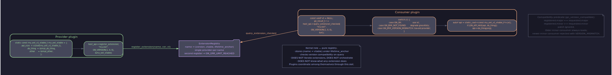

# Архитектура: расширения как plugin↔plugin контракт

## Содержание

- [Зачем расширения](#зачем-расширения)
- [API](#api)
- [Namespace gn.<area>](#namespace-gnarea)
- [Major-version compat](#major-version-compat)
- [Vtable shape](#vtable-shape)
- [Kernel = pure registry](#kernel--pure-registry)
- [Lifecycle](#lifecycle)
- [Versioned upgrade](#versioned-upgrade)
- [Пример: heartbeat plugin](#пример-heartbeat-plugin)
- [Anti-patterns](#anti-patterns)
- [Cross-refs](#cross-refs)

---

## Зачем расширения

Четыре роли плагина в GoodNet — handler, link, security, bridge — закрывают конкретные точки в жизненном цикле envelope'а. Handler сидит на `(protocol_id, msg_id)` и обрабатывает входящие сообщения. Link владеет одним URI scheme'ом и устанавливает соединения. Security даёт encrypt/decrypt и handshake. Bridge переливает foreign-system payload'ы в mesh под собственным identity. Каждой роли соответствует свой vtable type, своя точка регистрации и свой gate в ядре.

Эти четыре формы — типовая поверхность ядра. Но ядро никогда не знает заранее всех custom API, которые плагины захотят выставлять друг другу: `gn.peer-info` с известными для peer'а альтернативными URI, `gn.heartbeat` с RTT-статистикой по conn'ам, `gn.dht` с key-value lookup'ом, `gn.relay-fwd-table` со списком маршрутов через локальный relay. Эти контракты живут между плагинами, ядру по их семантике сказать нечего.

Расширения дают плагинам способ публиковать произвольные vtable'ы под именем и подписывать их версией, не расширяя ABI ядра. Плагин-автор объявляет `gn_<X>_api_t` в собственном header'е (как `sdk/extensions/heartbeat.h`), регистрирует его в ядре через одну функцию, а другие плагины достают его обратно через симметричную пару с major-version проверкой. Между ними — чистый pointer hand-off; ядро не парсит layout, не сериализует поля, не знает, какие там методы.

---

## API

Поверхность — две функции в `host_api_t`:

```c
gn_result_t (*register_extension)(void* host_ctx,
                                  const char* name,
                                  uint32_t version,
                                  const void* vtable);

gn_result_t (*query_extension_checked)(void* host_ctx,
                                       const char* name,
                                       uint32_t version,
                                       const void** out_vtable);

gn_result_t (*unregister_extension)(void* host_ctx,
                                    const char* name);
```

`register_extension` публикует `vtable` под именем `name` с версией `version`. Имя — стабильная C-строка, живущая всю lifetime'у плагина-публикатора; ядро не копирует, держит указатель. Vtable — `const void*` для ядра, плагин-автор знает, что это конкретный typed pointer на свою структуру.

`query_extension_checked` ищет ранее опубликованный vtable, сверяет major-версию (см. ниже) и возвращает указатель в `*out_vtable`. Если имя не найдено — `GN_ERR_NOT_FOUND`. Если major не совпадает — `GN_ERR_VERSION_MISMATCH`. Эти два случая различимы намеренно: плагин может перепрыгнуть на старую совместимую ветку или дождаться обновления провайдера, в зависимости от error code'а.



`unregister_extension` снимает запись по имени. Идемпотентность асимметрична: повторный вызов на уже снятое имя возвращает `GN_ERR_NOT_FOUND` — позволяет плагину распознать «я снимал, но кто-то снял раньше», не маскируя баг под success.

---

## Namespace gn.<area>

Имена расширений строятся по convention: `gn.<area>` или `gn.<area>.<sub>`. Префикс `gn.` — kernel-canon namespace; в нём живут расширения, которые кто-то когда-то написал и сейчас стали де-факто частью канонического стека: `gn.heartbeat`, `gn.peer-info`, `gn.relay`. Имя `gn.<area>` бронируется первым же плагином, который успел `register_extension` — ядро не управляет правом владения именем, оно лишь рассуживает дубликаты через `GN_ERR_LIMIT_REACHED` на втором registrate'е.

Свободные namespace — что угодно вне `gn.`. Плагин стороннего автора, который не претендует на каноническую интеграцию, регистрирует под `myorg.dht` или `acme.metrics-export`. Ядро эти имена не валидирует; плагин-консьюмер просто запрашивает их явно и получает либо vtable, либо `NOT_FOUND`. Наследуется ровно одно правило: имя не должно содержать NUL до своего конца, и оно UTF-8.

Конвенция `gn.<area>` даёт читаемость call-site'а. `query_extension_checked(api, "gn.heartbeat", VERSION, ...)` сразу узнаваем как обращение к каноническому heartbeat handler'у; никакой документации искать не приходится. Имя, которое не публично-каноническое, прячется в собственном header'е автора плагина и выдаётся через макрос-константу типа `GN_EXT_HEARTBEAT` (см. `sdk/extensions/heartbeat.h:25`), чтобы typo на call-site'е не превращалось в silent `NOT_FOUND`.

---

## Major-version compat

Версия — одно `uint32_t` поле в обоих slot'ах. Convention: верхние 16 бит — major, младшие 16 бит — minor. `GN_EXT_HEARTBEAT_VERSION = 0x00010000u` читается как «v1.0». Patch уровень в этой схеме не отдельно — он растворён в minor'е и не участвует в compat-проверке.

Сверка делает `gn_version_compatible` из `sdk/abi.h`:

- Major запрашиваемой версии должен быть равен major зарегистрированной. Любое расхождение — `GN_ERR_VERSION_MISMATCH`.
- Minor запрашиваемой ≤ minor зарегистрированной. Запросчик собран против старого slot-set'а, провайдер ушёл вперёд — лоадится. Запросчик собран против нового, провайдер на старом — отказ.

Семантика major'а — breaking change. Сменили signature метода, переименовали enum, поменяли invariant — incrementим major. Запросчики на старом major'е больше не лоадятся, что им и нужно: вызов несовместимого vtable'а — это segfault или silent corruption, лучше отказать на query.

Семантика minor'а — append-only. Добавили новое поле в конец vtable, новую константу в enum, новый необязательный slot. Старые запросчики продолжают работать через `api_size`-prefix evolution внутри самого vtable type'а (см. `abi-evolution.md` §3a) — поле, которого они не знают, лежит за их `api_size`, и они его не читают.

---

## Vtable shape

В терминах ABI ядра vtable — `const void*`. Layout определяет плагин-публикатор в собственном SDK header'е. Конвенция:

- Первое поле — `uint32_t api_size`, сохраняемое `sizeof()` структуры на момент сборки публикатора. Consumer гейтит чтение полей через `GN_API_HAS(vt, slot)`.
- Все методы — `int (*name)(void* ctx, ...args)` или `gn_result_t (*name)(void* ctx, ...args)`. Первый аргумент каждого метода — `ctx`, который сам vtable несёт в собственном поле `void* ctx;` ближе к концу.
- Хвост — `void* _reserved[N]` для будущих slot'ов в рамках одного major'а.

Пример из `sdk/extensions/heartbeat.h`:

```c
typedef struct gn_heartbeat_api_s {
    uint32_t api_size;
    int (*get_stats)(void* ctx, gn_heartbeat_stats_t* out);
    int (*get_rtt)(void* ctx, gn_conn_id_t conn, uint64_t* out_rtt_us);
    int (*get_observed_address)(void* ctx, gn_conn_id_t conn,
                                char* out_buf, size_t buf_size,
                                uint16_t* out_port);
    void* ctx;
    void* _reserved[4];
} gn_heartbeat_api_t;
```

Плагин-публикатор аллоцирует структуру (обычно статически), заполняет указатели на свои функции, прописывает `ctx = self`, и регистрирует через `register_extension(api, GN_EXT_HEARTBEAT, GN_EXT_HEARTBEAT_VERSION, &g_heartbeat_api_instance)`. Запросчик после успешного `query_extension_checked` cast'ит `*out_vtable` обратно к `const gn_heartbeat_api_t*` и зовёт `vt->get_rtt(vt->ctx, conn, &rtt_us)`.

Ядро в этом обмене не участвует. Оно держит запись `(name, version, void*)` и отдаёт `void*` запросчику. Понимание layout'а — на стороне публикатора и консьюмера, которые делят header.

---

## Kernel = pure registry

Ядро не walk'ит список расширений. Ни в одном слоте `host_api_t` нет `for_each_extension`, ни одной internal-функции `evaluate_all_optimizers`. Если плагин хочет скоординироваться с N другими плагинами, он query'ит каждого по имени явно. Имя — единственная форма обращения к расширению.

Ядро не вызывает методы vtable. Между `register_extension` и `unregister_extension` в кишках registry'а лежит `(name, version, vtable)` запись и больше ничего. Никакого scheduler'а, который бегает по записям и зовёт фиксированный slot. Никакого priority order'а, по которому одно расширение «главнее» другого. Никакого implicit chain'а, где результат одного вызова становится input'ом следующего.

Ядро не интерпретирует версии за пределами compat-проверки. Оно не знает, что v1.5 «лучше» v1.3, не предпочитает одну другой, не выбирает между двумя зарегистрированными под одним именем — потому что под одним именем зарегистрироваться может только один (повторный регистратор получает `GN_ERR_LIMIT_REACHED`).

Координация плагинов — целиком plugin-side. Если плагин A хочет среагировать на событие от плагина B, он подписывается на conn-state канал (`subscribe_conn_state`), плюс query'ит расширение B на момент события. Если плагин-orchestrator хочет последовательность «A потом B потом C» — он строит её в собственном control flow'е, дёргая методы каждого расширения по порядку. Ядро не знает про эти зависимости.

---

## Lifecycle

Запись регистрируется ровно когда плагин зовёт `register_extension`. До вызова — её нет, после `unregister_extension` или после teardown'а плагина — её снова нет. Запись не воскресает, не персистится между загрузками плагина, не сериализуется в config.

Auto-reap на shutdown'е плагина — safety net. `plugin-lifetime.md` §4 описывает lifetime-anchor'ом, который ядро держит на каждый плагин; при shutdown'е anchor expire'ит, и ядро walk'ит свои внутренние реестры (включая `ExtensionRegistry`) и снимает все записи, которые помнят этот anchor. Плагин, который не успел вызвать `unregister_extension` сам, не оставит дырявую запись с висячим pointer'ом — ядро её снимет.

Манипулировать lifetime'ом расширения программно — через те же два slot'а. Плагин, который хочет сменить major-версию своего расширения без полной выгрузки, зовёт `unregister_extension(name)`, потом `register_extension(name, new_version, new_vtable)`. Между ними — окно, в котором запросчики ловят `NOT_FOUND`; плагин заранее уведомляет своих известных консьюмеров через handler-channel, чтобы те не молотили в этот момент.

Vtable pointer, выданный через `query_extension_checked`, валиден ровно пока расширение зарегистрировано. Если плагин-публикатор unloaded'ится между query и call'ом, pointer становится dangling. Подписчик, который держит query-результат в долгую, обязан подписаться на свой собственный signal плагина-публикатора (через handler или через registered notification на собственный extension), чтобы понять, когда vtable стало небезопасно вызывать.

---

## Versioned upgrade

Добавление поля в конец vtable — minor bump. Старые запросчики продолжают читать только то, что им знакомо: их `api_size` не вырос, `GN_API_HAS` гейтит хвост, новое поле для них невидимо. Новые запросчики собраны против большего `api_size` и видят новое поле полностью.

Изменение существующего поля — major bump. Сигнатура метода уже зафиксирована для всех консьюмеров, собранных на этом major'е. Вместо мутации старого slot'а плагин-автор заводит новое имя или новый major:

- Имя в стиле `gn.peer-info` остаётся, версия `0x00010000u` — старая семантика. Параллельно регистрируется `gn.peer-info` под `0x00020000u` с новым vtable type'ом? — нет, это не работает, потому что под одним именем в один момент ровно одна запись.
- Или плагин держит обе версии одновременно под разными именами: `gn.peer-info` (v1) и `gn.peer-info.v2` (v2). Каждое имя — самостоятельная запись. Старые консьюмеры цепляются за `gn.peer-info`, новые — за `gn.peer-info.v2`. Когда трафик старого имени иссякает по операторской метрике, плагин-публикатор `unregister_extension`'ит legacy.

Major-bump через смену имени — каноническая трактовка breaking change'а. Это приём явный и наблюдаемый: оба имени видны в `iterate_counters` метриках, старое имя стирается на одной плановой минор-релизе.

---

## Пример: heartbeat plugin

`plugins/handlers/heartbeat/` — plugin role HANDLER. Регистрирует handler на `(protocol_id = "gnet-v1", msg_id = HEARTBEAT_MSG_ID)`, обрабатывает PING-овые envelope'ы от peer'ов, отвечает PONG-ами, замеряет round-trip time. Параллельно с handler-регистрацией плагин публикует расширение:

```c
host_api->register_extension(host_ctx,
                             GN_EXT_HEARTBEAT,
                             GN_EXT_HEARTBEAT_VERSION,
                             &g_heartbeat_api);
```

Через расширение другие плагины читают результаты замеров. Метод `get_rtt(ctx, conn, &rtt_us)` — это вопрос «какая RTT по этому соединению наблюдается прямо сейчас». Метод `get_observed_address(ctx, conn, buf, sz, &port)` — «как peer на той стороне видит наш external адрес» (STUN-on-the-wire без отдельного STUN-сервера).

Плагин-orchestrator, который решает «упгрейдить ли relay-routed соединение в direct», query'ит heartbeat:

```c
const gn_heartbeat_api_t* hb = NULL;
if (host_api->query_extension_checked(host_ctx,
                                      GN_EXT_HEARTBEAT,
                                      GN_EXT_HEARTBEAT_VERSION,
                                      (const void**)&hb) == GN_OK) {
    uint64_t rtt_us = 0;
    if (hb->get_rtt(hb->ctx, conn, &rtt_us) == 0
        && rtt_us < some_threshold_us) {
        attempt_direct_dial(peer_pk);
    }
}
```

Heartbeat-плагин не знает о существовании orchestrator'а; orchestrator не знает о деталях handler'а. Между ними — vtable и contract из header'а. Каждый из плагинов — независимая единица: heartbeat можно выгрузить и оставить в силе остальные, orchestrator работает без heartbeat'а через `NOT_FOUND` ветку (в этом случае он выбирает консервативно, не upgrade'ит).

---

## Anti-patterns

**Kernel-side iteration**. Идея «ядро собирает все зарегистрированные `gn.optimizer.*` и вызывает их по очереди» — отвергнута. Ядро не walk'ит список, не строит chain, не делегирует решение в массив плагинов. Если оркестрация над несколькими расширениями нужна — её делает плагин-orchestrator, явно query'я каждого по имени. Скрытый kernel-side fan-out непредсказуем для того, кто пишет плагин: он не понимает, в каком порядке его расширение будет вызвано относительно других, и любая семантика «я первый отвечу — остальные молчат» становится race condition'ом.

**Implicit ordering**. Идея «расширения сортируются по `priority`-полю, и ядро выбирает из них» — отвергнута. Ни поля `priority`, ни сравнения версий за пределами compat-check'а ядро не делает. Если плагин нужен «выше» другого — это решает orchestrator, а не registry.

**Chain-walking**. Идея «расширение возвращает результат, ядро feed'ит его в следующее» — отвергнута. Это handler-chain семантика; она существует, но строго в `(protocol_id, msg_id)` registry, а не в extension-registry. Плагин, которому нужен chain поверх своих расширений, строит его сам: query, call, передача результата, query следующего, call. Ядро в этом не участвует.

**Coordinate-with-N**. Плагин, который хочет скоординироваться с N другими — query'ит каждого по имени явно. Если имена N не известны заранее, плагин должен сам объявить convention (например, «зарегистрируйся под `myorg.responder`, я буду тебя искать»). Ядро не предоставляет «discovery» поверх расширений — это была бы implicit kernel iteration в маскировке.

---

## Cross-refs

- Контракт: [host-api.md](../contracts/host-api.en.md) — slot'ы `register_extension` / `query_extension_checked`, error semantics, lifetime.
- Контракт: [conn-events.md](../contracts/conn-events.en.md) — pub/sub для асинхронной координации между плагинами.
- Контракт: [security-trust.md](../contracts/security-trust.en.md) — TrustClass и upgrade, на который плагины часто реагируют через query.
- Архитектура: [overview](overview.ru.md) — место расширений в общей картине.
- Архитектура: [plugin-model](plugin-model.ru.md) — четыре роли плагина и их vtable shapes.
- Архитектура: [host-api-model](host-api-model.ru.md) — KIND-tagged primitives, ABI evolution.
- Архитектура: [relay-direct](relay-direct.ru.md) — конкретный пример plugin↔plugin координации через расширения.
