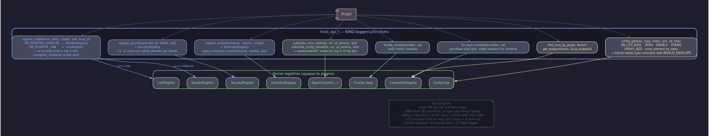

# Host API Model

## Содержание

- [Зачем единая таблица](#зачем-единая-таблица)
- [KIND-tagged primitives](#kind-tagged-primitives)
- [Семейства slots](#семейства-slots)
- [ABI evolution](#abi-evolution)
- [Type safety на C ABI границе](#type-safety-на-c-abi-границе)
- [host_ctx — opaque pointer](#host_ctx--opaque-pointer)
- [Backpressure через result codes](#backpressure-через-result-codes)
- [Cross-references](#cross-references)

---

## Зачем единая таблица

Плагин в GoodNet — это shared object, который ядро привязывает к себе через ровно одну C ABI таблицу: `host_api_t` из `sdk/host_api.h`. Всё, что плагин может попросить у ядра — отправить envelope, зарегистрировать handler, посмотреть peer'а в реестре, заглянуть в config — идёт через указатель на функцию из этой таблицы. Никакого второго пути «в обход» нет: плагины не видят kernel-internal `host_loader_api_t`, не имеют доступа к глобальному synthetic state, не дёргают приватные символы ядра через `dlsym`.

Single source of truth получается из принципа экономии когнитивной нагрузки автора плагина. Прочитал один заголовок — увидел всю поверхность. Тестируешь одну таблицу — покрыл все capability'и. Меняешь slot — компилятор ловит каждое использование, потому что оно одно. Альтернатива — россыпь global'ных C-функций или «ядро дёргает плагин через polymorphic dispatch» — превращает поверхность в неисчислимое множество и заставляет автора плагина следить за вкладами ядра. GoodNet эту ответственность на плагин не вешает.



Пара `(api*, host_ctx)` живёт от `gn_plugin_init` до возврата из `gn_plugin_shutdown`. Каждое поле таблицы — указатель на функцию, которая первым аргументом принимает тот самый `host_ctx`. Плагин держит один `api*` указатель и читает `api->host_ctx` всякий раз, когда нужно вызвать slot. Convenience-обёртки в `sdk/convenience.h` зашивают чтение `host_ctx` за макросом — call site выглядит как `gn_send(api, conn, msg_id, payload, size)`, без передачи `host_ctx` руками.

Ядро не опрашивает плагин. Любая активность ядра, относящаяся к плагину, либо вытаскивается через registry-snapshot (handler chain, link by scheme, security current), либо доставляется через subscription (conn-state event, config reload). Plugin-внутреннее состояние ядру неинтересно — оно скрыто за `self` указателем плагина. Ровно одна табличка наружу, ровно одна точка входа внутрь.

---

## KIND-tagged primitives

`host_api_t` несёт около двадцати одного слота. Это сжатый набор: исторически отдельные `register_handler` / `register_link` / `subscribe_data` / `subscribe_state` существовали как параллельные семьи, и каждая привносила свою сигнатуру. Теперь они стянуты в KIND-tagged примитивы:

```c
gn_result_t (*register_vtable)(void* host_ctx,
                               gn_register_kind_t kind,
                               const gn_register_meta_t* meta,
                               const void* vtable,
                               void* self,
                               uint64_t* out_id);

gn_result_t (*unregister_vtable)(void* host_ctx, uint64_t id);
```

`gn_register_kind_t` — enum из `sdk/types.h`. Сейчас два значения: `GN_REGISTER_HANDLER` и `GN_REGISTER_LINK`. Поле `meta->name` несёт protocol id для handler'а или URI scheme для link'а; `meta->msg_id` и `meta->priority` нужны только handler'у. Возвращённый `*out_id` кодирует тег семьи в верхних четырёх битах — `unregister_vtable(id)` маршрутизирует обратно в правильный реестр без повторного указания KIND.

Subscribe лёг в две именованные функции вместо одной union'-style:

```c
gn_result_t (*subscribe_conn_state)(void* host_ctx,
                                    gn_conn_state_cb_t cb,
                                    void* user_data,
                                    void (*ud_destroy)(void*),
                                    gn_subscription_id_t* out_id);

gn_result_t (*subscribe_config_reload)(void* host_ctx,
                                       gn_config_reload_cb_t cb,
                                       void* user_data,
                                       void (*ud_destroy)(void*),
                                       gn_subscription_id_t* out_id);

gn_result_t (*unsubscribe)(void* host_ctx, gn_subscription_id_t id);
```

Раздельные сигнатуры дают biding'ам строгую типизацию callback'а на канале без cast'ов через `(const void*, size_t)`. `unsubscribe` остаётся универсальной — id несёт channel tag в верхних битах и сам выбирает правильный канал.

`for_each_connection` пробегает реестр под per-shard read-lock'ом, отдавая visitor'у `(conn, trust, remote_pk, uri)`. Это единственный путь итерации; отдельных `for_each_handler` или `for_each_link` нет — плагин не управляет реестрами, он лишь даёт в них вклад. Сорок одна точка входа схлопнулась до двадцати одной с восемью зарезервированными slot'ами.

---

## Семейства slots

Slot'ы группируются по теме. Группы — это ментальная карта, не разделение в C: всё лежит подряд в `host_api_t` для предсказуемого ABI offset'а каждого имени.

### Registration

- `register_vtable(KIND_HANDLER | KIND_LINK, meta, vtable, self, &id)` — handler dispatch chain или link by scheme.
- `unregister_vtable(id)` — id сам несёт kind tag.
- `register_security(provider_id, vtable, self)` / `unregister_security(provider_id)` — security provider на trust class. v1 admits ровно одного активного провайдера на `Sessions::create`.
- `register_extension(name, version, vtable)` / `unregister_extension(name)` — публикация vtable под именем `gn.<area>` для plugin↔plugin lookup'а.

`register_security` живёт отдельным slot'ом, а не под общим KIND, потому что её trust-mask gate работает по-другому: kernel читает `vtable->allowed_trust_mask()` один раз и потом проверяет на каждом `notify_connect`. У handler/link такой стороны нет.

### Subscription

- `subscribe_conn_state(cb, user_data, ud_destroy, &id)` — события `CONNECTED` / `DISCONNECTED` / `TRUST_UPGRADED` / `BACKPRESSURE_*`.
- `subscribe_config_reload(cb, user_data, ud_destroy, &id)` — срабатывает после успешного `Kernel::reload_config`, без полезной нагрузки.
- `unsubscribe(id)` — id маршрутизируется по верхним битам.

Подписки парятся с weak observer'ом плагина — callback на уже выгруженный плагин дропается ядром молча, до того как control попадёт в plugin code. `ud_destroy` вызывается ровно один раз при снятии подписки или при наблюдаемой gone-ovision самого плагина.

### Iteration

- `for_each_connection(visitor, user_data)` — synchronous walk под per-shard read-lock; visitor возвращает 0 чтобы продолжить, не-ноль чтобы остановиться.
- `find_conn_by_pk(pk, &conn)` — точечный lookup; `GN_ERR_NOT_FOUND` если такого peer'а нет.

### Configuration

- `config_get(key, type, index, out_value, out_user_data, out_free)` — типизированное чтение из живого config-tree с runtime контрактом: плагин объявляет ожидаемый тип, ядро возвращает `GN_ERR_INVALID_ENVELOPE` при несовпадении. Парные `out_user_data` + `out_free` обязательны для STRING-чтения и запрещены для всех остальных, чтобы destructor type был однозначен в FFI binding'ах.
- `get_endpoint(conn, &out)` — peer endpoint по conn id; `out` caller-allocated.
- `limits()` — borrow на live `gn_limits_t`, валидный пока плагин загружен.

### Messaging

- `send(conn, msg_id, payload, payload_size)` — envelope на готовое соединение; ядро копирует payload до возврата.
- `notify_connect(remote_pk, uri, trust, role, &out_conn)` — link объявляет установленное соединение. Только role=Transport plugins могут вызывать.
- `notify_inbound_bytes(conn, bytes, size)` — горячий путь link'а: байты идут через security decrypt → protocol deframe → router dispatch.
- `notify_disconnect(conn, reason)` — link объявляет закрытие.
- `notify_backpressure(conn, kind, pending_bytes)` — link рапортует пересечение high/low watermark per `backpressure.md`.
- `kick_handshake(conn)` — после `notify_connect` ядро не запускает initiator's first message синхронно (race с регистрацией socket'а под conn id); link зовёт `kick_handshake` когда socket готов принимать байты.
- `inject(layer, source, msg_id, bytes, size)` — bridge plugin'ы инжектят foreign-system bytes под собственным identity. `LAYER_MESSAGE` строит envelope и роутит; `LAYER_FRAME` гонит байты через protocol deframer'а.

`disconnect(conn)` — закрытие соединения с любого потока.

### Lifecycle

- `set_timer(delay_ms, fn, user_data, &out_id)` — one-shot callback на kernel-owned single-thread service executor. `delay_ms = 0` — паттерн post-to-executor.
- `cancel_timer(id)` — идемпотентно.
- `is_shutdown_requested()` — non-zero как только ядро начало teardown плагина. Plugin polls flag в долгих async loop'ах и cooperatively выходит до drain timeout'а.

### Observability

- `emit_counter(name)` — bump kernel-side counter по UTF-8 имени. Convention: `<subsystem>.<event>.<reason>`.
- `iterate_counters(visitor, user_data)` — walk всех зарегистрированных counter'ов; out-of-tree exporter сериализует в любой wire format.
- `log` — substruct `gn_log_api_t` с парой `should_log(level)` / `emit(level, file, line, msg)`. Format-string trust boundary: ядро никогда не парсит `msg` через `vsnprintf` — компрометированный плагин не может протащить `%n` или `%s`-without-arg в kernel address space.

### Extension lookup

- `query_extension_checked(name, version, &out_vtable)` — major/minor compatibility check через `gn_version_compatible`. Запрашиваемая major == зарегистрированной, запрашиваемая minor ≤ зарегистрированной. Patch игнорируется. Различает `GN_ERR_NOT_FOUND` (не зарегистрирован) и `GN_ERR_VERSION_MISMATCH` (зарегистрирован, но old).

Cross-plugin координация идёт ровно через эту пару: один плагин зовёт `register_extension(name, version, vtable)`, другой ловит через `query_extension_checked`. Ядро здесь — pure registry, оно vtable не интерпретирует.

---

## ABI evolution

`host_api_t` начинается с `uint32_t api_size`. Producer (ядро) проставляет `sizeof(host_api_t)` на своей стороне; consumer (плагин) видит размер, который ядро экспортировало. Slot, который плагин ожидает, может оказаться за пределами этого размера — тогда плагину придётся обойтись.

Pre-rc1 окно открыто для shape-изменений. Slot'ы могут переименовываться, типы аргументов уточняться, неиспользуемые семьи сжиматься. Это — единственный момент, когда reshape бесплатен.

После rc1 эволюция строго additive. Новый slot всегда appended at the tail; восемь зарезервированных void* в `_reserved[8]` промотируются в named поля по одному за минор. Существующие байты `_reserved` не reused — это ломает ABI на consumer'ах, собранных против промежуточной версии.

`GN_API_HAS(api, slot)` из `sdk/abi.h` сочетает size-prefix presence check с null-pointer check'ом:

```c
if (GN_API_HAS(api, kick_handshake)) {
    api->kick_handshake(host_ctx, conn);
}
```

Slot, видимый в `api_size`, всё равно может быть NULL — ядро может зарезервировать имя в эволюции, но не сразу его реализовать. Consumer'ы которые читают tail-slot'ы обязаны проходить через `GN_API_HAS`, иначе segfault на старшей минор-версии плагина против младшей минор-версии ядра.

---

## Type safety на C ABI границе

Сырая C ABI оставляет много ручной работы: занулять `api_size` метаданных, не забывать `host_ctx`, не путать тип `out_value` в `config_get`. `sdk/convenience.h` поверх raw таблицы даёт inline-обёртки, которые делают вызов идиоматичным:

```c
/* Вместо raw:
 * api->register_vtable(api->host_ctx, GN_REGISTER_HANDLER,
 *                      &meta, &vt, self, &id);
 */
gn_register_handler(api, "gnet-v1", 0x42, /*priority*/ 128,
                    &vtable, self, &id);

/* Вместо raw:
 * api->config_get(api->host_ctx, "links.tcp.bind_port",
 *                 GN_CONFIG_VALUE_INT64, GN_CONFIG_NO_INDEX,
 *                 &port, NULL, NULL);
 */
int64_t port;
gn_config_get_int64(api, "links.tcp.bind_port", &port);
```

Обёртки — pure C, header-only, видимы из любого FFI-capable языка. Plugin author не зовёт `register_vtable` руками — он зовёт `gn_register_handler`, чьё тело — одна строка вызова raw slot'а. Это поднимает type-safety на уровень call site'а: компилятор отказывается принять `int64_t*` там, где slot ждёт `char**`, ещё до того, как байты попали в ядро.

Языковые binding'и поверх SDK дают свой typed layer. C++ обёртка в `sdk/cpp/` принимает `std::span<const uint8_t>` и `std::string_view`; Rust binding мапит slot'ы на `unsafe fn` со строгими типами и `#[must_use]` Result'ом. Convenience.h — общий C-уровень, к которому крепятся все остальные.

---

## host_ctx — opaque pointer

`host_ctx` — это void* указатель, которым ядро ассоциирует loader-side state с конкретным плагином. Перед возвратом из `gn_plugin_init` ядро прописывает поле `api->host_ctx`; плагин его никогда не разыменовывает, не сравнивает с другими, не сериализует. Просто кладёт обратно первым аргументом каждого вызова slot'а.

Зачем это нужно. Ядро держит per-plugin counters, weak observer на lifetime-anchor, gate состояние для async callback'ов, role descriptor (link / handler / security / bridge). Когда плагин зовёт `notify_connect`, ядру нужно знать — это link-role плагин, и значит slot разрешён, или handler-role, и тогда возврат — `GN_ERR_NOT_IMPLEMENTED`. `host_ctx` — это handle на ту самую запись, через которую gate отрабатывает мгновенно по pointer comparison'у вместо string lookup'а по плагину.

Pointer carry'ит scope плагина. Не per-thread — плагин может звать slot'ы из любого потока, который владеет ссылкой на `api`. Не per-conn — соединения адресуются через `gn_conn_id_t`. Lifetime — от возврата `gn_plugin_init` до возврата `gn_plugin_shutdown`. После shutdown'а ядро может dlclose-нуть `.so`, и dereference `host_ctx` через старый `api*` указатель — undefined.

Гарантия из `host-api.md`: `api->host_ctx` стабилен на всю lifetime'у плагина, opaque, и идентифицирует loader-side state ядра для этого плагина. Ничего больше плагин про него знать не должен.

---

## Backpressure через result codes

`send` возвращает `gn_result_t`. Hot-path кодировка:

- `GN_OK` — envelope принят, очередь не нагружена.
- `GN_BP_SOFT_LIMIT` (через отдельный enum в `sdk/types.h`) — пройден low watermark, отправитель должен сбавить темп.
- `GN_BP_HARD_LIMIT` — драп, не ретраим в tight loop'е.
- `GN_BP_DISCONNECT` — соединение ушло, прекращаем.

Игнорировать `HARD_LIMIT` и долбить `send` в цикле — контрактное нарушение. Кernel detect'ит через counters, плагин получает `metrics.host_api.send.errors` flood в логах.

Параллельно с return code'ом ядро публикует `BACKPRESSURE_SOFT` / `BACKPRESSURE_CLEAR` события на conn-state канал. Подписчик читает `pending_bytes` из payload'а и принимает решение — это внешний наблюдатель (метрики, optimizer, UI). Sender-side сам видит результат `send` и может реагировать локально, без подписки.

`inject` следует тому же паттерну плюс per-source token bucket: 100 messages/sec с burst'ом 50 на каждый source conn по умолчанию, ключ — первые 8 байт `remote_pk` источника. Bucket consumes ровно после прохождения всех остальных гейтов (argument validation, layer-specific size cap, presence of protocol layer); ошибки на ранних стадиях не съедают токены — иначе плагин с плохими input'ами выжигал бы лимит легитимного трафика.

---

## Cross-references

- Контракт: [`host-api.md`](../contracts/host-api.md) — slot list, error semantics, forbidden patterns, foreign-payload injection, service executor.
- Контракт: [`abi-evolution.md`](../contracts/abi-evolution.md) — size-prefix gating, `_reserved` slot promotion rules.
- Контракт: [`plugin-lifetime.md`](../contracts/plugin-lifetime.md) — `gn_plugin_init` / `register` / `unregister` / `shutdown` ordering.
- Контракт: [`backpressure.md`](../contracts/backpressure.md) — high/low watermark publishing.
- Контракт: [`timer.md`](../contracts/timer.md) — service-executor invariants.
- Контракт: [`config.md`](../contracts/config.md) — config tree shape, reload signal.
- Архитектура: [`plugin-model`](./plugin-model.md) — четыре роли плагина, dlopen pipeline, vtable shapes.
- Архитектура: [`extension-model`](./extension-model.md) — plugin↔plugin coordination через `query_extension_checked`.
