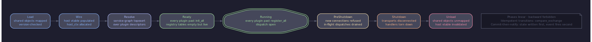

# Архитектура: восьмифазная FSM ядра

<!-- livedoc:embed_kernel_fsm -->
<!-- generated by tools/livedoc.py — do not edit by hand; rerun `make livedoc` to refresh -->



_Kernel lifecycle: created → started → stopped → destroyed._
<!-- /livedoc:embed_kernel_fsm -->


## Содержание

- [Зачем явная FSM](#зачем-явная-fsm)
- [Восемь фаз](#восемь-фаз)
- [Переходы](#переходы)
- [Наблюдаемость](#наблюдаемость)
- [Двухфазная активация плагинов](#двухфазная-активация-плагинов)
- [Quiescence на shutdown](#quiescence-на-shutdown)
- [Что плагин может делать в каждой фазе](#что-плагин-может-делать-в-каждой-фазе)
- [Восстановление ошибок](#восстановление-ошибок)

---

## Зачем явная FSM

Жизнь узла можно описать неявно — «грузим всё что нашли, потом
работаем, потом останавливаемся». Платформа держит вместо этого
восьмифазную state-machine с named-фазами и публичной шиной событий.
Каждое состояние ядра наблюдаемо извне: оператор и плагин узнают, в
какой именно фазе находится узел, через атомарный read и через
подписку на `PhaseEvent`. Чёрных переходов нет; любое движение
вперёд по FSM — это compare-and-exchange, после которого
`SignalChannel<PhaseEvent>` фаерит подписчикам пару `(prev, next)`.

Прямое следствие — обнаружимость багов на старте. Если плагин не
зарегистрировал свой vtable в `Resolve`, accept-loop никогда не
дойдёт до `Running`, и узел остановится с диагностическим логом
вместо тихого «а почему сообщения не доходят».

Сквозное правило — commit-then-notify. Поле `Phase`-атомика
обновляется первым; лишь после удачного `compare_exchange` колбэки
наблюдателей получают пару `(prev, next)`. Подписчик, читающий
`Kernel::current_phase()` из своего обработчика, всегда видит
новое состояние, не старое.

---

## Восемь фаз


### Load

Bootstrap-фаза. Ядро инициализирует libsodium, читает identity-файл
(или генерирует новый Ed25519-keypair, если оператор включил
auto-generate), парсит конфиг через `Config::load_json`. Доступны
read-only IO и kernel-internal allocations. Запрещены: `dlopen`,
сетевые операции, любые callback'и в плагины. Сигнал на выходе —
`PhaseEvent{Load → Wire}`.

Типичные ошибки: identity-файл с битым форматом, конфиг с
несовместимой схемой, ENV-переменная с путём вне executable
directory.

### Wire

`host_api_t` полностью построен через `host_api_builder.cpp`,
все 21 слот заполнены адресами kernel-thunks, `_reserved[8]`
обнулён. Регистрируются статические kernel-internal-плагины:
`plugins/protocols/gnet` (canonical mesh-framing) — обязательно;
`plugins/protocols/raw` — опционально, если оператор включил.
Статические плагины линкуются в бинарь ядра и не проходят через
`dlopen`; они всё равно вызывают `host_api->register_*` через
inline-shim. Запрещён `dlopen`, запрещены любые сетевые I/O.
Сигнал на выходе — `PhaseEvent{Wire → Resolve}`.

### Resolve

Динамические подгружаемые плагины загружаются по списку, который
оператор передал через `gn_core_load_plugin(path, sha256)`. Для
каждого плагина: путь резолвится относительно executable directory
(через relative-path-check, чтобы закрыть LD_LIBRARY_PATH-вектор);
SHA-256 файла сравнивается с переданным манифестом
(`plugin-manifest.md`); расхождение — `GN_ERR_INTEGRITY_FAILED`,
загрузка прерывается. При совпадении — `dlopen` с
`RTLD_NOW | RTLD_LOCAL`, резолвится пять плюс один экспортируемых
символов: `gn_plugin_sdk_version`, `gn_plugin_init`,
`gn_plugin_register`, `gn_plugin_unregister`, `gn_plugin_shutdown`,
опциональный `gn_plugin_descriptor`. Дальше — версия SDK, затем
`init_all` по топосортированному порядку: каждому плагину вызывается
`gn_plugin_init(api, &self)`. На этой стадии плагин выделяет
буферы, парсит свой блок конфига, готовит state, но **не**
регистрирует ни одного vtable.

Запрещены: вызов `register_*` из `gn_plugin_init`, accept inbound,
любая сеть. Разрешены: `config_get`, `query_extension_checked` (для
расширений, опубликованных в стат-плагинах), `set_timer(0, ...)`
для отложенной регистрации.

Типичные ошибки: SDK-major mismatch, манифест-хеш не совпал,
init вернул `GN_ERR_OUT_OF_MEMORY`. Любая ошибка `init_all`
запускает `rollback_init` — каждому уже проинициализированному
плагину вызывается `gn_plugin_shutdown`, и узел останавливается с
оригинальным error-кодом.

### Ready

Все плагины прошли `init_all`, теперь `register_all` устанавливает
их vtable в kernel-регистры. Каждый плагин последовательно вызывает
`gn_plugin_register(self)`, и внутри — `host_api->register_vtable`,
`register_security`, `register_extension`. Регистры держат записи
по anchor'у плагина; снэпшот при дальнейшем lookup'е будет
возвращать копии по значению.

После завершения `register_all` ядро находится в Ready. Все vtable
установлены, шина сигналов слушает, executor готов, но accept-loop
не запущен — link-плагины ещё не открыли listener-сокеты.

Сигнал на выходе — `PhaseEvent{Ready → Running}`.

Ошибка `register_all` (например, две регистрации под одной
URI-схемой) запускает `rollback_register`: каждому уже
зарегистрированному плагину вызывается `gn_plugin_unregister`,
дальше — `rollback_init` через `gn_plugin_shutdown`, узел
останавливается.

### Running

Стационарное состояние. Link-плагины открывают свои сокеты,
принимают входящие соединения, дозванивают исходящие. Для каждого
поднятого канала link вызывает `host_api->notify_connect(remote_pk,
uri, trust, role, &out_conn)` — ядро аллоцирует `gn_conn_id_t`,
создаёт security-сессию в `Handshake`-фазе и публикует
`ConnEvent::CONNECTED` через `SignalChannel`. Дальше link-плагин
вызывает `kick_handshake(conn)`, и ядро гонит initiator-side
рукопожатие через зарегистрированный security-провайдер.

Все слоты `host_api` доступны: `send`, `disconnect`,
`subscribe`, `set_timer`, `inject`, `notify_inbound_bytes`,
`notify_disconnect`, `notify_backpressure`, `for_each_connection`,
`config_get`, `emit_counter`, `query_extension_checked`. Дисптач
сообщений идёт через `Router` по приоритетной цепочке handler'ов;
каждый возвращает `gn_propagation_t` (CONTINUE / CONSUMED /
REJECT) — ядро эту тройку никогда не выбрасывает.

### PreShutdown

Триггерится `Kernel::stop()` (либо из `gn_core_stop`, либо из
сигнала ОС). Compare-and-exchange гарантирует, что ровно один
поток входит в shutdown-walk; конкурирующие вызовы возвращаются
сразу. Ядро публикует `shutdown_requested = true` на anchor'ах
всех плагинов, link-плагины перестают принимать новые соединения
(но активные остаются живыми и могут дослать buffered-сообщения).

Долгоиграющая асинхронная работа в плагинах поллит
`is_shutdown_requested(host_ctx)` и кооперативно завершается:
периодические таймеры перестают перезаряжаться, multi-step
posted-задачи возвращаются без планирования следующего шага,
queue-drain-воркеры выходят из цикла. Это не обязательная фаза
— плагин, не поллящий флаг, всё равно завершится корректно,
просто медленнее, через kernel-side gate, отбрасывающий
постфлаговые dispatch'и.

### Shutdown

Все живые соединения закрываются через `disconnect`; ядро
публикует `ConnEvent::DISCONNECTED` для каждого. Затем для каждого
плагина в обратном toposort-порядке: `gn_plugin_unregister(self)` —
снимает все его регистрации (handler, link, security, extension);
ожидание quiescence через generation-counter, чтобы in-flight
снэпшоты успели завершиться; промоция strong-ref в weak-наблюдатель;
ожидание expiry weak'а (bounded, default 1с); вызов
`gn_plugin_shutdown(self)` — плагин освобождает свой `self`.

После `gn_plugin_shutdown` плагин **не** имеет права звать
`host_api`. Любые async-задачи, не отменённые до этого момента,
ловятся kernel-side gate'ом и отбрасываются.

### Unload

`dlclose` для каждого подгруженного `.so` в обратном порядке
загрузки. Если quiescence-wait для какого-то плагина истёк по
таймауту — anchor.so leaks (`PluginManager::leaked_handles()`
бампается, в логе пишется warning с in-flight-count). Шарик
библиотеки остаётся в памяти, но это observable leak, не
silent UAF. Сигнал — финальный `PhaseEvent{Shutdown → Unload}`,
после чего шина сигналов сама сворачивается, и kernel destructor
завершает работу.

---

## Переходы

```
Load → Wire → Resolve → Ready → Running → PreShutdown → Shutdown → Unload
```

Граф направленный, без skip'ов и без обратных рёбер.
`is_forward_transition(prev, next)` (`core/kernel/phase.hpp`)
возвращает `true` ровно для двух случаев: `prev == next`
(идемпотентный no-op, observers не оповещаются) и
`next == prev + 1`. Любая попытка перепрыгнуть через фазу или
вернуться назад — программная ошибка, `advance_to` возвращает
`false` без мутации.

Ранний exit допустим: если на фазе `Load` или `Resolve` стартап
проваливается (битый конфиг, плагин с несовпавшим хешем,
`init_all` вернул ошибку), ядро **не** идёт в обратный walk через
`Running` и `PreShutdown`. Вместо этого `rollback_init` /
`rollback_register` локально откатывают что успели сделать, и
ядро переходит сразу в `Unload`. Pseudo-граф ранних путей:

```
Load → (config error) → Unload
Wire → (libsodium init error) → Unload
Resolve → (manifest mismatch) → rollback_init → Unload
Ready → (register_all failure) → rollback_register → rollback_init → Unload
```

Эти короткие пути — не отдельные фазы, а ramp-down той же FSM:
ядро ровно один раз публикует финальное состояние, и любой
наблюдатель видит линейную последовательность фаз без сюрпризов.

---

## Наблюдаемость

Фазовые переходы публикуются через стандартную шину сигналов из
[`signal-channel.md`](../contracts/signal-channel.en.md). Конкретный
канал — `SignalChannel<PhaseEvent>`; `PhaseEvent` несёт пару
`(prev, next)` плюс монотонный sequence-number для дедупликации.
Подписаться можно kernel-internal через
`Kernel::subscribe(weak_ptr<IPhaseObserver>)`; плагины
подписываются через размеченный канал host_api `subscribe`-слота
с дискриминатором `GN_SUBSCRIBE_PHASE` (см.
[`fsm-events.md`](../contracts/fsm-events.en.md) §7).

Слабая природа подписки прощает плагину забытый `unsubscribe`:
weak_ptr-наблюдатель естественно протухает, как только плагин
выгружен, и подписка убирается из списка при следующем `fire`.
Реентерабельность тоже гарантирована — `fire` снимает snapshot
под shared-lock и вызывает обработчиков из снэпшота вне локов,
поэтому subscribe / unsubscribe из колбэка безопасны.

В дополнение к фазовым событиям ядро публикует:

- `ConnEvent` — `CONNECTED`, `DISCONNECTED`, `TRUST_UPGRADED`,
  `BACKPRESSURE_SOFT`, `BACKPRESSURE_CLEAR`. Канал —
  `Kernel::on_conn_event()`.
- `on_config_reload` — пустой `Empty`-event после успешного
  `reload_config` или `reload_config_merge`. Подписчик
  перечитывает свои ключи через `config_get`.

`MetricsRegistry` параллельно копит named-counter'ы
(`route.outcome.*`, `drop.*`, `plugin.leak.dlclose_skipped`),
которые exporter-плагин читает через `iterate_counters`. Шина
сигналов и метрики — два независимых наблюдательных пути; они
не дублируют друг друга.

---

## Двухфазная активация плагинов

Resolve и Ready — структурно разные фазы, и это не косметика.
Между ними проходит вся `init_all`-волна, и только когда **каждый**
плагин успешно построил свой state, ядро переходит к
`register_all`. Без этой границы частичный init-fail приводил бы к
gnarly-состоянию: один плагин уже зарегистрировал handler, второй
упал в init, ядро вынуждено `dlclose` обоих, при этом dispatch уже
мог попасть в первого. Двухфазная активация выносит регистрацию
на отдельный этап, где «все или никто»: либо все 8 плагинов
зарегистрировались, либо `rollback_register` снимает успевших и
ядро останавливается чисто.

Контракт описан в
[`plugin-lifetime.md`](../contracts/plugin-lifetime.en.md) §5.
Ключевое наблюдение: между `init_all` и `register_all` плагины
**уже имеют живой `host_api`**, но **ещё не видят** друг друга
через регистры. Это даёт окно для `query_extension_checked` —
плагин-зависимый от extension'а другого плагина — вызвать поиск
из `gn_plugin_register`, не из `gn_plugin_init`.

---

## Quiescence на shutdown

PreShutdown — это не пауза, а кооперативный wait-окно. Ядро
последовательно для каждого плагина:

1. **Публикует флаг** `shutdown_requested` на anchor'е плагина.
   Виден изнутри плагина через `is_shutdown_requested(host_ctx)`
   и снаружи — kernel-side gate отбрасывает любые async-callback'и,
   прибывшие после публикации.
2. **Вызывает `gn_plugin_unregister`** — registry-записи теряют
   свои anchor-копии. Live-снэпшоты, уже взятые dispatch'ами,
   удерживают anchor по-своему.
3. **Отменяет pending-таймеры** и posted-задачи для этого
   anchor'а, чтобы drain-окно не растягивалось задачами, которые
   плагин не отозвал кооперативно.
4. **Промоутит strong-ref в weak**, дропает свою сильную
   ссылку. Anchor живёт, пока хоть один in-flight dispatch
   держит свою копию.
5. **Ждёт expiry** weak'а, bounded — по умолчанию 1 секунда.
6. **Вызывает `gn_plugin_shutdown`** — плагин освобождает
   `self`. Drain в шаге 5 гарантирует, что callback'и,
   захватившие `user_data` от `self`, уже завершились.
7. **`dlclose`** — безопасен; ни один снэпшот не разыменовывает
   plugin-text, ни один callback не сидит в plugin-коде.

Если drain истёк — шаг 5 не дождался expiry — менеджер плагинов
**пропускает** `dlclose`: сохраняет handle в leak-список,
бампит счётчик `plugin.leak.dlclose_skipped`, пишет warning с
in-flight-count'ом. .so остаётся mapped, leftover-работа
разыменовывает живой код. Это сознательный trade-off:
наблюдаемая утечка лучше silent UAF.

---

## Что плагин может делать в каждой фазе

| Фаза | register | subscribe | dial | send | disconnect | timers |
|---|---|---|---|---|---|---|
| Load | — | — | — | — | — | — |
| Wire | static only | — | — | — | — | — |
| Resolve | — (init_all) | ✓ | — | — | — | ✓ (delay 0) |
| Ready | ✓ (register_all) | ✓ | — | — | — | ✓ |
| Running | ✓ | ✓ | ✓ | ✓ | ✓ | ✓ |
| PreShutdown | unregister only | unsubscribe only | — | active conn'ы | ✓ | cancel only |
| Shutdown | unregister only | — | — | — | — | — |
| Unload | — | — | — | — | — | — |

«register» в столбце — означает `host_api->register_vtable`,
`register_security`, `register_extension`. «dial» — link-side
`notify_connect` для исходящего соединения. «active conn'ы» в
PreShutdown означает: новые соединения отказываются, но send
по уже открытым conn'ам разрешён, чтобы плагин успел сбросить
buffered application-сообщения перед drain'ом. Любая попытка
вызвать запрещённый слот возвращает `GN_ERR_INVALID_STATE`;
ядро не уточняет, какая именно фаза была неподходящей —
плагин обязан знать своё состояние.

`config_get` и `emit_counter` доступны от Wire до Shutdown
включительно. `is_shutdown_requested` валиден на всём
протяжении плагин-lifetime; вне этого окна вызов — UB.

---

## Восстановление ошибок

Платформа не даёт частичных стартов. Если на `Resolve` один из
плагинов вернул ошибку из `gn_plugin_init`, ядро **не** идёт
дальше с оставшимися семью — узел отказывается стартовать,
оригинальный error-код пробрасывается из `gn_core_init` обратно
в приложение. Это сознательный жесткий выбор: смешанная
полу-загрузка означала бы handler-цепочки с дырами, неполный
mesh-routing, тихие drop'ы сообщений по неочевидным причинам.

Лента откатов:

- **`gn_plugin_init` вернул ошибку** на N-м плагине — ядро
  для каждого предшествующего плагина (`0..N-1`) вызывает
  `gn_plugin_shutdown(self)`, запоминает первый error-код,
  переходит сразу в `Unload`, `dlclose`-ит все уже подгруженные
  .so, возвращает оригинальную ошибку.
- **`gn_plugin_register` вернул ошибку** — ядро для каждого
  ранее зарегистрированного плагина вызывает
  `gn_plugin_unregister(self)`, затем выполняет `rollback_init`
  как выше.
- **Ошибка во время Running** (handler упал, exception перешёл
  C ABI границу) — ядро ловит её через `safe_invoke`-обёртку,
  возвращает `GN_ERR_INTERNAL` в callsite, бампит
  `host_api.<entry>.errors`-counter. Узел продолжает работать;
  один проблемный handler не валит весь mesh.
- **Ошибка во время Shutdown** — игнорируется, walk-shutdown
  продолжается. Цель этой фазы — drain, не recovery.

Это правило «либо все восемь плагинов запустились, либо ни одного»
делает шум на старте громким и видимым: оператор узнаёт о бажном
плагине в первой секунде запуска, а не через десять минут
после сообщения, не дошедшего до пира.
