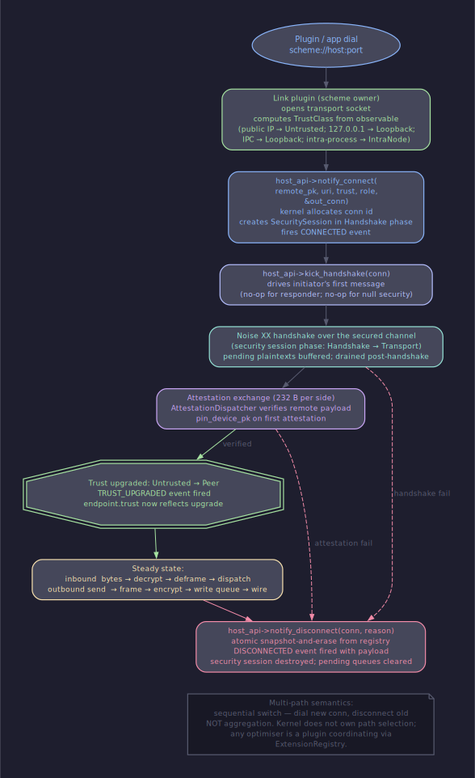

# Архитектура: несколько путей до одного peer'а

## Содержание

- [Один активный путь](#один-активный-путь)
- [Шаблон последовательного переключения](#шаблон-последовательного-переключения)
- [Почему не агрегация](#почему-не-агрегация)
- [Несколько URI на одного peer'а](#несколько-uri-на-одного-peerа)
- [События, запускающие переключение](#события-запускающие-переключение)
- [Корректное закрытие старого пути](#корректное-закрытие-старого-пути)
- [Идентичность connection поверх transport'а](#идентичность-connection-поверх-transportа)
- [Cross-refs](#cross-refs)

---

## Один активный путь

GoodNet ведёт по одному peer'у ровно одну запись в `ConnectionRegistry` с
одной активной link-сессией и одной активной security-сессией. Поле
`link_scheme` в `gn_endpoint_t` хранит имя транспорта, которым открыт
этот путь; в любой момент времени запись отвечает на запросы по трём
ключам — `conn_id`, `uri`, `remote_pk` — и все три указывают на один и
тот же объект (см. [registry.md](../contracts/registry.en.md) §1).

Ни в коде ядра, ни в публичном `gn_endpoint_t` нет массива путей —
никакого `paths_[]`, никакого «active path selector». Эта плоскость
сознательно тонкая: ядро не выбирает между TCP и UDP, не считает RTT,
не строит и не сравнивает «качества» путей. Плагин-владелец сценария
делает это сам.

История миграций тоже plugin-side: если плагину нужно помнить, что час
назад тот же peer был достижим через relay, он держит свою таблицу
`peer_pk → история URI` в собственном хранилище. Ядро такие следы не
сохраняет — после `notify_disconnect` (см.
[conn-events.md](../contracts/conn-events.en.md) §2a) запись и связанные
с ней счётчики уничтожаются.

---

## Шаблон последовательного переключения

Когда плагин решает, что текущий путь до peer'а нужно сменить, он
действует строго последовательно: открывает новый, дожидается, пока
тот закрепится, и только потом закрывает старый. Алгоритм:

1. Плагин вызывает `host_api->dial(host_ctx, new_uri, scheme, &new_conn)`
   — link-плагин нужного `scheme` начинает свой `connect`, а ядро
   возвращает свежевыделенный `gn_conn_id_t`.
2. Плагин подписан на канал `GN_SUBSCRIBE_CONN_STATE` через
   `host_api->subscribe_conn_state` (см.
   [host-api.md](../contracts/host-api.en.md) §2). Подписка существовала
   до dial'а — иначе событие `CONNECTED` нового пути может уйти раньше,
   чем callback подключится (канал не пере-доставляет события задним
   числом, см. [conn-events.md](../contracts/conn-events.en.md) §5).
3. На событие `GN_CONN_EVENT_CONNECTED` для `new_conn` плагин ждёт
   следующего шага — `GN_CONN_EVENT_TRUST_UPGRADED` с `trust_class ==
   GN_TRUST_PEER`. До этого момента новый путь не authenticated, и
   переключаться на него нельзя; см.
   [security-trust.md](../contracts/security-trust.en.md) §3.
4. Когда оба события пришли, плагин вызывает
   `host_api->disconnect(host_ctx, old_conn,
   GN_DISCONNECT_REASON_MIGRATED)`. Ядро публикует `DISCONNECTED` для
   старой записи; плагин на своей стороне переписывает таблицу
   `peer_pk → conn_id`, чтобы новые `send` уходили в `new_conn`.

Application-уровень видит свопу через события: либо плагин фильтрует и
прячет `DISCONNECTED` старого conn'а под extension'ом «миграция», либо
прикладной handler сам делает dedup по `peer_pk`. Ядро в этом не
участвует.

---

## Почему не агрегация

Параллельная агрегация bandwidth (отправлять байты сразу через TCP и
UDP, склеивать на той стороне) требует упорядочивающего слоя поверх
transport'а: переупорядочиваний, окна повторной сборки, общего sequence
number'а. Любой такой слой добавляет head-of-line blocking — медленный
путь блокирует доставку быстрого до момента склейки — и удваивает
поверхность для атак replay'я.

Агрегация полезна примерно в 1% сценариев: видеоконференция через
два uplink'а, гипотетический «multipath QUIC» в датацентре. В
оставшихся 99% (LAN, NAT, мобильный peer) последовательное
переключение даёт тот же UX — peer достижим — без сложности
re-ordering'а.

GoodNet до тега держит `single-active` инвариант. После rc1
агрегация может прилететь как opt-in extension: плагин
`gn.multipath-bond` поверх двух обычных connection'ов плюс свой
upper-layer protocol-handler. Ядро при этом останется тем же — оно
по-прежнему регистрирует две независимые connection-записи и не знает
про их связь.

---

## Несколько URI на одного peer'а

Один и тот же peer обычно достижим по нескольким адресам: LAN-IP,
публичный IP через NAT-traversal, IPC-путь на той же машине, relay-URI
третьей ноды. Список этих адресов peer объявляет либо во время
handshake (announce-сообщение в защищённом канале), либо через
broadcast discovery, либо плагин достаёт из persistent peer-cache.

Источник списка — целиком plugin-side. Ядро не знает про concept'ы
«peer-info», «alternative URIs» и не хранит их. Плагин, который
оперирует мульти-URI, регистрирует свой extension (типичное имя —
`gn.peer-info`) и через `register_extension` отдаёт другим плагинам
vtable вида `get_peer_uris(peer_pk, out_list)`.

Ядро принимает на вход любой URI, прошедший grammar-проверку (см.
[uri.md](../contracts/uri.en.md) §2), и находит link-плагин по `scheme`
из `LinkRegistry`. Идентичность peer'а — это `remote_pk`, не URI;
свопая URI, плагин не теряет identity peer'а и не вынужден
пере-attest'ить связь с ним повторно (`device_pk` уже закреплён в
peer-pin map'е, см. [registry.md](../contracts/registry.en.md) §8a).

---

## События, запускающие переключение

Плагин решает, **когда** мигрировать, по входящим в его сторону
сигналам. Ядро на эту тему ничего не знает: оно не следит за RTT, не
сравнивает throughput, не имеет встроенных таймеров «попробовать
direct через 5 сек».

Источниками решения служат:

- Heartbeat-extension `gn.heartbeat` (см.
  [`sdk/extensions/heartbeat.h`](../../sdk/extensions/heartbeat.h)).
  Через `get_rtt(conn, out_rtt_us)` плагин читает RTT по конкретной
  связи. Скачок RTT относительно baseline'а — нормальный триггер
  попробовать другой путь.
- `BACKPRESSURE_SOFT` на канале `GN_SUBSCRIBE_CONN_STATE`. Очередь
  отправки на текущем link'е переполнилась — это сигнал, что путь
  деградировал.
- Произвольный extension, который peer объявил у себя и
  zarejistrировал через `register_extension`: NAT-verdict от
  STUN-on-the-wire, geo-hint, cost-hint в случае платных
  uplink'ов.

Плагин подписан на эти события синхронно (callback бежит на нити
publisher'а) и обязан быть быстрым; долгая работа уходит через
`set_timer(0, …)` на сервисный executor.

---

## Корректное закрытие старого пути

Параметр `reason` в `notify_disconnect` сейчас в v1 reserved — ядро
его игнорирует и не транслирует подписчикам (см.
[conn-events.md](../contracts/conn-events.en.md) §2a). Тем не менее
плагины передают `GN_DISCONNECT_REASON_MIGRATED` по двум причинам:
во-первых, запись попадает в `metrics.host_api.disconnect.errors` с
этим лейблом и оператор отличает миграцию от обрыва; во-вторых, в
v1.x `reason` начнёт сурфачиться в `gn_conn_event_t`, и плагины,
написанные сегодня, после ABI-расширения сразу станут различимыми.

Application, которое ведёт долгий request/response поверх
connection'а, читает `peer_pk` через `get_endpoint` и пере-маршрутизирует
запросы на новый `conn_id` после получения `CONNECTED` нового пути.
До завершения миграции в очередь старого `conn`'а класть новые
сообщения не нужно — `disconnect` отрубает их без доставки.

---

## Идентичность connection поверх transport'а

`peer_pk` стабилен между путями: один и тот же 32-байтовый
public-key идентифицирует peer'а вне зависимости от того, через
какой `scheme` сейчас открыт link. `conn_id` — наоборот,
эфемерен: он живёт ровно от `notify_connect` до `notify_disconnect`,
после чего ядро помечает его как заново использовать нельзя
(структурно невозможно при текущих rates, см.
[registry.md](../contracts/registry.en.md) §6).

Из этого следует разделение ответственности в плагинах:

- Логика, которая «знает peer'а» (queue его сообщений, держит сессию
  поверх transport'а, ведёт статистику по peer'у) индексируется по
  `peer_pk`.
- Логика, которая работает с конкретной связью (отправка байтов,
  подписка на backpressure для именно этого link'а, выбор очереди по
  `link_scheme`) индексируется по `conn_id`.

Плагин миграции владеет таблицей `peer_pk → conn_id` и обновляет её на
паре событий (`CONNECTED` нового, `DISCONNECTED` старого). Application,
которому миграция должна быть прозрачна, читает `peer_pk` всегда — и
никогда не кэширует `conn_id` дольше, чем длится один send.

---

## Strategy plugins поверх sequential switch

Sequential-switch primitive — это foundation, поверх которого
живут конкретные routing strategies. Float-send (auto-best path
по RTT / cost / privacy), relay (multi-hop forwarding), DHT
(distributed peer routing) — все они реализуются как plugin
extensions и используют `dial(new) → notify_connect →
disconnect(old)` цикл, описанный выше.

Plugin author не пишет multi-path логику с нуля для каждой
strategy — он выбирает heuristic (когда переключать), composes
через существующий примитив, expose'ит peer_pk-level API через
extension namespace вроде `gn.float-send.rtt-optimal`.

Класс strategy plugins описан в [`strategies`](./strategies.ru.md).

---

## Cross-refs

- Контракт событий: [conn-events.md](../contracts/conn-events.en.md)
- Контракт регистра: [registry.md](../contracts/registry.en.md)
- Контракт URI: [uri.md](../contracts/uri.en.md)
- Trust-class и upgrade: [security-trust.md](../contracts/security-trust.en.md)
- host_api: [host-api.md](../contracts/host-api.en.md)
- Strategy plugins: [strategies.ru.md](./strategies.ru.md)
- Конкретный пример того же шаблона: [relay-direct](relay-direct.ru.md)
- Как extension выставляет себя в shared namespace: [extension-model](extension-model.ru.md)
- Жизнь security-сессии в этом цикле: [security-flow](security-flow.ru.md)
- Пошаговый рецепт переключения: [recipes/](../recipes/)
