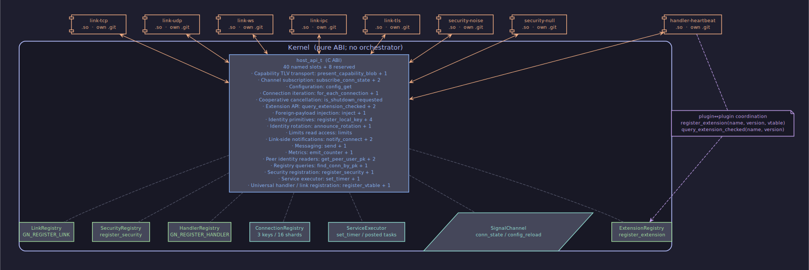

# Архитектура: обзор

<!-- livedoc:embed_architecture -->
<!-- generated by tools/livedoc.py — do not edit by hand; rerun `make livedoc` to refresh -->



_Kernel ABI surface, registries, and the eight plugin slots._
<!-- /livedoc:embed_architecture -->


## Содержание

- [Платформа](#платформа)
- [Границы](#границы)
- [Что знает ядро](#что-знает-ядро)
- [Чего ядро не делает](#чего-ядро-не-делает)
- [C ABI как граница](#c-abi-как-граница)
- [Слои документации](#слои-документации)
- [Поток жизни узла](#поток-жизни-узла)
- [С чего начать](#с-чего-начать)

---

## Платформа

GoodNet — это фреймворк для mesh-сетей, в котором каждое решение о
транспорте, шифровании и маршрутизации передано наружу, в плагины. Узел
получает идентичность из 32-байтового Ed25519 публичного ключа; всё
остальное — выбор дозвона, формат рукопожатия, политика повторных
попыток, агрегация телеметрии — живёт в подгружаемых модулях,
скомпилированных против стабильного C ABI. Ядро по построению агностично
к проводу: оно не знает ни о TCP, ни о Noise, ни о Heartbeat, и
запускается ровно с тем набором плагинов, который собрал оператор.

---

## Границы

Платформа разделена на четыре зоны ответственности — каждая со своим
git-репозиторием, собственным циклом релизов и собственным набором
тестов.


**Ядро** (`core/`) держит регистры, шину сигналов, исполнитель
сервисных задач и обязательный mesh-framing-слой. Оно не содержит ни
одной wire-константы транспортов и ни одного знания о
криптопровайдере. Все примитивы — `Phase`, `ConnectionRegistry`,
`HandlerRegistry`, `LinkRegistry`, `ExtensionRegistry`,
`SecurityRegistry`, `Router`, `TimerRegistry`, `MetricsRegistry` —
описаны в `core/kernel/kernel.hpp` и собраны в одну единицу трансляции.

**SDK** (`sdk/`) — публичный C ABI: `host_api_t` для плагинов,
`gn_core_*` для приложений-операторов, типы из `sdk/types.h` и
`sdk/plugin.h`, плюс размер-префиксная схема эволюции из
`sdk/abi.h`. Это единственная поверхность, через которую общаются
ядро и плагин; всё, что не в `sdk/`, — частная реализация.

**Плагины** (восемь подгружаемых единиц) живут каждый в своём
репозитории. Handler-плагин `heartbeat`; link-плагины `tcp`, `udp`,
`ws`, `ipc`, `tls`; security-плагины `noise`, `null`. К ним
примыкает sibling-репозиторий `integration-tests`. Каждый плагин
собирается как `.so`, грузится через `dlopen` после проверки
SHA-256-манифеста и регистрирует свои vtable через `host_api`.

**Apps** — операторская сторона. Бинарь `goodnet`, демо, инструменты
тестирования. Все они держат `gn_core_t*` через `sdk/core.h`,
загружают плагины по списку и подписываются на сообщения. На стороне
приложения нет особых привилегий: те же примитивы, что и у плагинов,
просто другая сторона ABI.

Внутри `core/` отдельно стоят два «kernel-internal» статических
плагина — `plugins/protocols/gnet` и `plugins/protocols/raw` —
линкуемые в бинарь ядра. Они реализуют интерфейс
`IProtocolLayer`, и хотя физически живут в дереве ядра, они
взаимодействуют с ним через тот же контракт
[protocol-layer](../contracts/protocol-layer.en.md), что и любой
внешний layer.

---

## Что знает ядро

Ядро держит ровно четыре класса состояния. Всё остальное вынесено в
плагины.

**Регистр соединений.** `ConnectionRegistry` — sharded-map от
`gn_conn_id_t` к записи, в которой лежат `remote_pk`, trust-class,
endpoint и счётчики. Соединения создаются исключительно через
`notify_connect`; ядро никогда не диалит само и не выбирает
транспорт.

**Регистры vtable.** `HandlerRegistry` хранит обработчики
прикладных сообщений, упорядоченные по приоритету; `LinkRegistry`
— один link-vtable на URI-схему; `SecurityRegistry` — один
активный провайдер; `ExtensionRegistry` — именованные vtable
расширений с `(major, minor)`-проверкой при `query_extension_checked`.
Каждая запись держит lifetime-anchor владеющего плагина; снэпшот при
диспетче возвращается по значению, и его копия anchor'а сохраняет
плагин живым на время вызова.

**Шина сигналов.** Один `SignalChannel<Event>` на тип события:
`PhaseEvent`, `ConnEvent`, config-reload. Подписка возвращает токен,
снять — идемпотентно. `fire()` снимает снэпшот под shared-lock и
вызывает обработчиков из снэпшота вне локов; повторный вход безопасен.

**Исполнитель и таймеры.** `TimerRegistry` поверх однотредного
сервисного executor'а: `set_timer(0, …)` — пост-без-задержки,
`set_timer(N, …)` — отсроченный вызов. Каждая задача парится с weak-наблюдателем
anchor'а плагина; колбэк, у которого плагин уже выгружен,
тихо отбрасывается.

Ничего из этого списка не помнит, какой это плагин, что он делает с
байтами и какой transport-сценарий. Ядро видит только KIND-теги
регистраций и `gn_conn_id_t`-handle.

---

## Чего ядро не делает

Решения принимают плагины. Ядро не выбирает путь, не решает, когда
переподключаться, не назначает приоритеты, не ходит по списку
зарегистрированных vtable в поисках «лучшего». В платформе нет
оркестратора: ядро никогда не вызывает плагин «сверху», за исключением
синхронных диспетчей вдоль уже регистрированной цепочки обработчиков и
выбранного link-vtable.

Соответственно нет и kernel-резидентных policy-движков: ни
path-manager'а, ни reconnect-manager'а, ни session-manager'а. Любая
такая логика, если оператор её хочет, реализуется как плагин,
подписывающийся на `ConnEvent` и публикующий собственное
extension-vtable. Multi-path в платформе моделируется как
последовательное переключение: плагин дозванивает новый канал,
ждёт `CONNECTED`, после чего закрывает старый. Агрегация нескольких
путей в один — не часть базового контракта.

Trust-классы (`Untrusted`, `Peer`, `Loopback`, `IntraNode`) — фиксированный
набор; единственный разрешённый переход — `Untrusted → Peer` после
mutual-attestation в `AttestationDispatcher`. Понизить класс
посреди живого соединения нельзя; security-плагин, который попытается,
получает отказ из ядра.

См. [plugin-model](plugin-model.ru.md) и
[extension-model](extension-model.ru.md) — две peer-страницы этого
архитектурного слоя, где раскрывается, как плагины решают друг за друга.

---

## C ABI как граница

Между ядром и плагином — один тонкий слой: `host_api_t` (см.
[host-api](../contracts/host-api.en.md)). Структура начинается с
`uint32_t api_size` и `void* host_ctx`, дальше идёт ровно один
register-вход с KIND-тегом, четыре notify-входа для link-роли,
универсальный subscribe/unsubscribe-канал, типизированный
`config_get`, set/cancel-timer, метрики, лог-substruct
`gn_log_api_t` и `is_shutdown_requested` для кооперативной отмены.
Хвост — массив `_reserved[8]` для будущих расширений.

Все слоты size-prefix-эволюционируемы: плагин, собранный против
старшего SDK, гейтит вызов через `GN_API_HAS(api, slot)` и читает
поле, только если producer'овский `api_size` его покрывает. Размер
поверхности — около 21 named-слота; больше не появится без минорного
ABI bump'а с обратной совместимостью.

KIND-тегированный `register_vtable(KIND, meta, vtable, self,
&out_id)` принимает `GN_REGISTER_HANDLER` (имя — protocol id, плюс
`msg_id` и `priority`) и `GN_REGISTER_LINK` (имя — URI-схема).
Security-провайдеры регистрируются через отдельный
`register_security`, расширения — через `register_extension` с
`(major, minor)`-версией. Возвращённый id несёт KIND в верхних
четырёх битах, поэтому `unregister_vtable(id)` не требует
повторно называть семейство.

Подробнее — на странице [host-api-model](host-api-model.ru.md).

---

## Слои документации

Документация уложена пятиуровневой пирамидой. Каждый слой опирается
только на нижележащий и видим читателю с конкретной задачей.

```
recipes/         — «хочу сделать X — покажите шаги»
   ↑
architecture/    — «как куски стыкуются» (этот документ)
   ↑
contracts/       — «какое точное правило между A и B»
   ↑
sdk/             — «какие типы и указатели правило производит»
   ↑
core/, plugins/  — «как правило реализовано в v1»
```

Контракты — durable-артефакт; они меняются только под правилами
[abi-evolution](../contracts/abi-evolution.en.md). Архитектурный
слой — этот — рассказывает, как
контракты складываются в платформу: какие куски ядро держит у
себя, какие отдаёт наружу, и почему граница нарисована именно так.
Recipes-слой ориентирован на задачу («запустить узел из двух
плагинов», «написать link-плагин»). Impl-слой — language-specific
шаблоны и идиомы для каждого FFI-привязки.

---

## Поток жизни узла

Запуск узла — линейный walk через восьмифазную FSM ядра. Сначала
`Load` — ядро читает конфиг, инициализирует libsodium, восстанавливает
identity из ключевого хранилища. Затем `Wire` — host_api полностью
собран, статические протокольные плагины зарегистрированы. На фазе
`Resolve` приложение через `gn_core_load_plugin` загружает динамические
.so-плагины: для каждого выполняется проверка SHA-256-манифеста,
`dlopen` с `RTLD_NOW | RTLD_LOCAL`, проверка SDK-версии, `gn_plugin_init`,
затем `gn_plugin_register`. На `Ready` все vtable установлены, но
accept-loop ещё не запущен. Переход в `Running` открывает приём.

Останов идёт зеркально через `PreShutdown` (отказ от новых
соединений, drain in-flight-диспетчей), `Shutdown` (закрытие живых
соединений, отписка subscriptions, cancel timers), `Unload` (`dlclose`
плагинов в обратном порядке загрузки).

Подробное прохождение каждой фазы — на странице
[kernel-fsm](kernel-fsm.ru.md).

---

## С чего начать

**Автору плагина.** Прочесть [host-api](../contracts/host-api.en.md) и
[plugin-lifetime](../contracts/plugin-lifetime.en.md), затем контракт
для своей роли — [link](../contracts/link.en.md),
[handler-registration](../contracts/handler-registration.en.md),
[security-trust](../contracts/security-trust.en.md). Дальше —
`impl/<язык>/` со шаблонами под конкретный FFI-биндинг.

**Контрибьютору ядра.** Войти через [kernel-fsm](kernel-fsm.ru.md) и
[fsm-events](../contracts/fsm-events.en.md), затем
[plugin-model](plugin-model.ru.md) и
[host-api-model](host-api-model.ru.md). Регистры разобраны на
[registry](../contracts/registry.en.md) и в исходниках под
`core/registry/`.

**Оператору, отлаживающему развёртывание.** Начать с
[conn-events](../contracts/conn-events.en.md) и
[backpressure](../contracts/backpressure.en.md), потом
[metrics](../contracts/metrics.en.md). FSM-фазы и сигналы — это первый
наблюдаемый слой при любых проблемах со стартом.

---

## Test coverage

Per-tree gtest / rapidcheck inventory across kernel-side and
per-plugin suites — auto-extracted by `tools/livedoc.py` from
`TEST`, `TEST_F`, `TEST_P`, `TYPED_TEST`, `RC_GTEST_PROP` macro
sites.

<!-- livedoc:test_inventory_table -->
<!-- generated by tools/livedoc.py — do not edit by hand; rerun `make livedoc` to refresh -->

_1080 test cases across 14 tree(s)._

| Tree | Cases | Files |
|---|---:|---:|
| [`tests/`](../../tests) | 771 | 70 |
| [`plugins/handlers/heartbeat`](../../plugins/handlers/heartbeat) | 11 | 1 |
| [`plugins/links/ice`](../../plugins/links/ice) | 59 | 3 |
| [`plugins/links/ipc`](../../plugins/links/ipc) | 8 | 2 |
| [`plugins/links/quic`](../../plugins/links/quic) | 11 | 1 |
| [`plugins/links/tcp`](../../plugins/links/tcp) | 14 | 2 |
| [`plugins/links/tls`](../../plugins/links/tls) | 21 | 3 |
| [`plugins/links/udp`](../../plugins/links/udp) | 21 | 2 |
| [`plugins/links/ws`](../../plugins/links/ws) | 13 | 2 |
| [`plugins/protocols/gnet`](../../plugins/protocols/gnet) | 63 | 4 |
| [`plugins/protocols/raw`](../../plugins/protocols/raw) | 10 | 1 |
| [`plugins/security/noise`](../../plugins/security/noise) | 50 | 4 |
| [`plugins/security/null`](../../plugins/security/null) | 18 | 1 |
| [`plugins/strategies/float_send_rtt`](../../plugins/strategies/float_send_rtt) | 10 | 1 |
<!-- /livedoc:test_inventory_table -->
