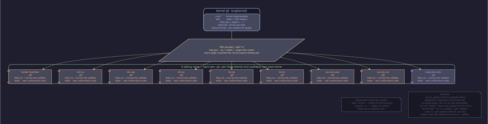
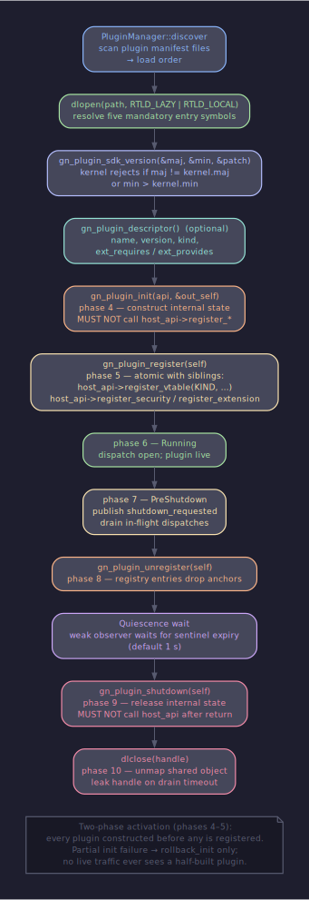

# Plugin Model

## Содержание

- [Четыре роли](#четыре-роли)
- [Жизненный цикл .so плагина](#жизненный-цикл-so-плагина)
- [Handler vtable](#handler-vtable)
- [Transport (link) vtable](#transport-link-vtable)
- [Security provider vtable](#security-provider-vtable)
- [Extension vtable](#extension-vtable)
- [Композиция ролей](#композиция-ролей)
- [Static plugins (kernel-internal)](#static-plugins-kernel-internal)
- [Plugin separation](#plugin-separation)
- [Trust class matters](#trust-class-matters)
- [Cross-references](#cross-references)

---

## Четыре роли

GoodNet делит плагины на четыре роли, каждая со своей vtable. Один shared object может фигурировать в нескольких ролях одновременно — просто экспортирует несколько vtable и регистрирует каждую отдельным вызовом host API.

| Роль | Vtable | Реестр ядра | Слот регистрации |
|---|---|---|---|
| Handler | `gn_handler_vtable_t` | HandlerRegistry | `register_vtable(GN_REGISTER_HANDLER, …)` |
| Transport (link) | `gn_link_vtable_t` | LinkRegistry | `register_vtable(GN_REGISTER_LINK, …)` |
| Security provider | `gn_security_provider_vtable_t` | SecurityRegistry | `register_security(provider_id, …)` |
| Extension | произвольный typed vtable | ExtensionRegistry | `register_extension(name, version, …)` |

Handler ловит envelope по паре `(protocol_id, msg_id)` и решает propagation. Link перевозит байты между peer'ами по URI scheme. Security держит handshake state и encrypt/decrypt по trust class'у. Extension — свободная форма plugin↔plugin координации, ядро туда не лезет, оно лишь хранит указатель на vtable и гонит lookup через `query_extension_checked`.




Heartbeat иллюстрирует композицию: один shared object регистрирует handler на PING/PONG msg_id и параллельно публикует extension `gn.heartbeat` (`sdk/extensions/heartbeat.h`) с slot'ами `get_stats` / `get_rtt` / `get_observed_address`. Link plugins (TCP, WS, IPC, TLS) часто экспонируют per-link extension `gn.link.<scheme>` через slot'ы `extension_name` / `extension_vtable` своей link vtable — там лежат runtime tweaks и stats, которые не вписываются в универсальный link контракт.

`gn_plugin_kind_t` в descriptor'е плагина — это role gate, а не объявление одной фиксированной роли. Значения: `LINK`, `HANDLER`, `SECURITY`, `PROTOCOL`, `BRIDGE`, `UNKNOWN`. Kernel split'ит часть host-API surface по role'у: только `LINK` и `BRIDGE` плагины могут звать loader-side `notify_connect` / `notify_inbound_bytes` / `notify_disconnect` / `kick_handshake`. Handler-role плагин получает `GN_ERR_NOT_IMPLEMENTED` если попытается изобразить link.

---

## Жизненный цикл .so плагина

Загрузка плагина — это многоступенчатый pipeline. Каждый шаг должен пройти, прежде чем следующий получит шанс — на любом отказе ядро возвращается на корректное состояние, не оставив торчащих регистраций.



### Discovery

Плагин лежит файлом `<libname>.so`. Рядом — sidecar JSON `<libname>.json` с per-package metadata: имя, kind, версия, описание, SHA-256 распространяемого бинарника. Этот sidecar — артефакт build infrastructure'а, не trust root: его эмитит `nix/buildPlugin.nix` при сборке. Сам по себе он плагину никаких прав не даёт.

Trust root живёт в operator manifest'е — `manifest.json` с полем `plugins: [{path, sha256}, …]`. Operator (или CI pipeline) указывает SHA-256 каждого `.so`, который имеет право загружаться. Manifest парсится через `PluginManifest::parse` и ставится через `PluginManager::set_manifest`.

В developer mode (manifest пустой, `set_manifest_required(false)`) ядро принимает любой `.so`. В production mode (manifest есть и required) каждый load consults manifest before dlopen — расхождение SHA-256 даёт `GN_ERR_INTEGRITY_FAILED` с диагностикой «manifest sha256 mismatch on: …», и `dlopen` не вызывается. Tampered binary не успевает выполнить static initializer'ы.

### Verification

На Linux 5.6+ verification и dlopen работают на одном и том же file descriptor:

1. `openat2(AT_FDCWD, path, O_RDONLY | O_CLOEXEC, RESOLVE_NO_SYMLINKS | RESOLVE_NO_MAGICLINKS)` — отказывает на любой symlink в path'е.
2. `sha256_of_fd(fd)` — pread-based streaming в 64 KiB чанках, seek state остаётся на нуле.
3. `verify_digest(path, observed)` — manifest lookup + compare.
4. `dlopen("/proc/self/fd/N")` — loader резолвит тот же inode, который ядро только что хешировало.

Это закрывает класс symlink-swap атак между hash и load. Старшие kernel'ы получают fallback на `open(path, O_NOFOLLOW)`, который защищает только leaf-component.

### Symbol resolution

После dlopen ядро резолвит пять обязательных символов:

- `gn_plugin_sdk_version(major*, minor*, patch*)` — отдаёт build-time SDK триплет. Без side-effect'ов.
- `gn_plugin_init(api*, out_self*)` — конструирует internal state.
- `gn_plugin_register(self)` — устанавливает vtable'ы в kernel dispatch tables.
- `gn_plugin_unregister(self)` — снимает регистрации.
- `gn_plugin_shutdown(self)` — освобождает self-owned ресурсы.

Шестой, опциональный символ `gn_plugin_descriptor` отдаёт static metadata: `name`, `version`, `hot_reload_safe`, `ext_requires` / `ext_provides` (массивы для toposort'а), `kind`. Если descriptor найден — ядро использует его для service-graph dependency ordering.

### SDK ABI version check

`gn_plugin_sdk_version` возвращает три uint32. Ядро сравнивает: plugin major должна совпадать с kernel major (otherwise `GN_ERR_VERSION_MISMATCH`); plugin minor не должна превышать kernel minor — плагин может пользоваться tail slot'ами только если они существуют. Patch игнорируется.

Несовпадение здесь короткое замыкание: плагин не получает `host_api*`, `gn_plugin_init` не вызывается, `dlclose` отзывается немедленно.

### Two-phase activation

`PluginManager::activate` идёт в два прохода:

```
Pass 1 — init_all
    for each descriptor in load_order:
        descriptor.init(api, &self)
        on failure: rollback_init и return

Pass 2 — register_all
    for each descriptor in load_order:
        descriptor.register(self)
        on failure: rollback_register; rollback_init; return
```

Первый проход конструирует every plugin instance, не трогая ни одной dispatch table. Второй проход вешает vtable'и в реестры. Без этого split'а partial init failure мог бы ранать `dlclose` на sibling plugin, пока dispatch в один из его handler'ов всё ещё in-flight.

Plugin author гарантирует: `gn_plugin_init` не зовёт `host_api->register_*`. Регистрация только в `gn_plugin_register`. Внутри `init` плагин аллоцирует буферы, парсит config через `config_get`, готовит self state — но не объявляет себя реестрам.

### Running phase

После того как register_all отработал на каждом descriptor'е, kernel переходит в `on_running`. С этого момента живой трафик может поступить в любой handler из chain'а; live `notify_inbound_bytes` приземляется на security provider'а; subscription'ы получают события.

### Shutdown

```
pre_shutdown:    publish shutdown_requested на каждый plugin anchor
unregister_all:  снимаем registry entries в reverse load_order
                 cancel pending timers, posted tasks для anchor'а
drain wait:      bounded wait (default 1s) пока async callback'и не выйдут
shutdown_all:    gn_plugin_shutdown на каждом self
dlclose:         unmap shared object
```

Shutdown flag — advisory: kernel-side gate перед каждым async callback'ом проверяет flag и просто отказывает в dispatch, если он стоит. Плагин которому flag безразличен — корректен, просто кончается его drain budget. Плагин который polls flag в долгих loop'ах — выходит за микросекунды и не растягивает kernel teardown.

Если drain timeout истёк, kernel логирует in-flight count и **leak'ит dlclose handle**. `.so` остаётся mapped, leftover work dereference'ит живой code, а не unmapped память. `PluginManager::leaked_handles()` делает leak observable.

---

## Handler vtable

Handler регистрируется через `register_vtable(GN_REGISTER_HANDLER, meta, vt, self, &id)`. Поле `meta->name` — protocol id (`"gnet-v1"`); `meta->msg_id` — per-protocol routing key; `meta->priority` — 0..255 dispatch order.

```c
typedef struct gn_handler_vtable_s {
    uint32_t         api_size;
    const char*      (*protocol_id)(void* self);
    void             (*supported_msg_ids)(void* self,
                                          const uint32_t** out_ids,
                                          size_t* out_count);
    gn_propagation_t (*handle_message)(void* self,
                                       const gn_message_t* envelope);
    void             (*on_result)(void* self,
                                  const gn_message_t* envelope,
                                  gn_propagation_t result);
    void             (*on_init)(void* self);
    void             (*on_shutdown)(void* self);
    void* _reserved[4];
} gn_handler_vtable_t;
```

`handle_message` возвращает propagation:

- `GN_PROPAGATION_CONTINUE` — следующий handler в chain'е получает envelope.
- `GN_PROPAGATION_CONSUMED` — chain прерывается, envelope обработан.
- `GN_PROPAGATION_REJECT` — envelope отброшен, connection закрыт.

Kernel walks chain в priority-descending порядке. Equal priority — registration order. Multiple handlers могут делить `(protocol_id, msg_id, priority)`; insertion order resolves ties. Maximum chain length per `(protocol_id, msg_id)` — `Limits::max_handlers_per_msg_id`, default 8. Превышение — `GN_ERR_LIMIT_REACHED` на регистрации.

Snapshot chain'а материализуется один раз при envelope arrival. Регистрация во время dispatch'а — no-op для текущего envelope, видна со следующего. Lookup сделан под RCU: registry mutations публикуют new read-only chain snapshot, dispatcher читает whichever snapshot был current при entry. Per-snapshot `lifetime_anchor` strong refs держат vtable валидным до конца walk'а — concurrent unregistration превращается в possibly-stale dispatch на snapshot'е, никогда не use-after-free.

`on_result` вызывается после каждого `handle_message`, с propagation value. Handler'ы которым нечего делать на tail'е оставляют пустой. Этот slot важен для observability handler'ов (relay counters, DHT bucket refresh) — они получают reliable callback ordering без необходимости wrap'нуть `handle_message` собственной логикой.

`gn_message_t::conn_id` — inbound-edge connection. Handler который gates behaviour на этом поле обязан tolerate `GN_INVALID_ID` как `CONTINUE`, никогда `REJECT` — иначе forward-compatible producer (envelope без edge'а) ломает connection peer'у который играл по правилам.

Reserved msg_id values недоступны для регистрации: `0x00` — unset sentinel, `0x11` — attestation dispatcher. Регистрация против них даёт `GN_ERR_INVALID_ENVELOPE`. Kernel-internal handler'ы не используют этот реестр; их dispatch path идёт ahead of registry chain lookup, перехватывая envelope сразу после `deframe`.

---

## Transport (link) vtable

Link перевозит байты. Не интерпретирует payload, не аутентифицирует peer'ов, не маршрутизирует messages. Регистрируется через `register_vtable(GN_REGISTER_LINK, meta, vt, self, &id)` где `meta->name` — URI scheme (`"tcp"`, `"udp"`, `"ws"`, `"ipc"`, `"tls"`).

```c
typedef struct gn_link_vtable_s {
    uint32_t api_size;
    const char* (*scheme)(void* self);
    gn_result_t (*listen)(void* self, const char* uri);
    gn_result_t (*connect)(void* self, const char* uri);
    gn_result_t (*send)(void* self, gn_conn_id_t conn,
                        const uint8_t* bytes, size_t size);
    gn_result_t (*send_batch)(void* self, gn_conn_id_t conn,
                              const gn_byte_span_t* batch, size_t count);
    gn_result_t (*disconnect)(void* self, gn_conn_id_t conn);
    const char* (*extension_name)(void* self);
    const void* (*extension_vtable)(void* self);
    void        (*destroy)(void* self);
    void* _reserved[4];
} gn_link_vtable_t;
```

`listen(uri)` — link парсит URI, биндит socket'ы. `connect(uri)` — initiate outbound; link callback'ает через `host_api->notify_connect` когда underlying handshake (например, TCP three-way) завершён. `send` — `@borrowed` bytes на длительность вызова; link copies internally если нужно retain. `send_batch` — scatter-gather через `gn_byte_span_t batch[count]`, link может coalesce через `writev`-style multiplex.

Single-writer invariant: at most one task пишет в данный underlying socket в моменте. Concurrent writes на один socket дают interleaved bytes на проводе; контракт сериализует их так, что link implementation видит single-writer семантику. Batch covers under тот же gate — batch не должен interleave с другими send'ами на том же conn'е.

Trust class declared link'ом на `notify_connect`:

| Connection property | Declared TrustClass |
|---|---|
| AF_UNIX socket | `Loopback` |
| Peer address `127.0.0.1` / `::1` | `Loopback` |
| Public TCP / UDP address | `Untrusted` |
| Intra-process pipe | `IntraNode` |

Link не declares ничего сильнее `Peer`. Upgrade `Untrusted → Peer` — kernel responsibility, идёт после mutual attestation. Loopback / IntraNode — final classes, gate отказывает в любой transition off них.

Handshake role на каждом `notify_connect`: `INITIATOR` для outbound, `RESPONDER` для inbound. Misreporting role — silent failure: Noise XX initiator который думает что responder будет fail'ить every handshake без actionable diagnostic.

Per-link extension через `extension_name` / `extension_vtable` — runtime stats, control knob'ы. Например `gn.link.tcp` отдаёт send queue depth, dropped frames counter, connection table snapshot. Эта пара slot'ов делает per-link evolution возможной без изменения универсального `gn_link_vtable_t` shape'а.

`destroy(self)` вызывается ровно после `unregister_link` и full quiescence — link освобождает self-owned ресурсы, закрывает остающиеся socket'ы, joins'ит worker thread'ы.

---

## Security provider vtable

Security provider терминирует handshake, выводит transport keys, encrypt/decrypt'ит per-message data. Канонический provider — Noise XX (`plugins/security/noise/`); null provider существует для loopback / intra-node connections где Noise лишний.

Регистрируется отдельным slot'ом `register_security(provider_id, vtable, self)`, не через универсальный `register_vtable`. Причина: vtable несёт `allowed_trust_mask()`, который kernel reads ровно один раз при регистрации и enforces на каждом `Sessions::create`. У handler / link такой стороны нет.

Vtable layout: `provider_id` отдаёт стабильный identifier (`"noise-xx"`, `"noise-ik"`, `"null"`). `handshake_open(conn, trust, role, local_sk, local_pk, remote_pk*, &state)` создаёт handshake state; `remote_pk` non-NULL когда pattern знает peer'а up-front (IK initiator), NULL когда узнаёт в ходе handshake'а (XX, NK). `handshake_step(state, incoming, in_size, &out_msg)` гонит один шаг pattern'а. `handshake_complete(state)` — boolean test. `export_transport_keys(state, &out_keys)` отдаёт symmetric keys + handshake hash для channel binding'а; provider zeroes свой copy после export. `encrypt(state, plaintext, &out)` / `decrypt(state, ciphertext, &out)` per-message AEAD. `rekey(state)` — atomic both-cipher reset. `handshake_close(state)` zeroes remaining key material.

`allowed_trust_mask()` возвращает bitmap из `1u << GN_TRUST_<X>`. Noise provider declares `Untrusted | Peer | Loopback | IntraNode`. Null provider declares `Loopback | IntraNode`. Connection чей trust class не в mask'е rejected at `SessionRegistry::create` до того, как handshake byte рideт.

Stack policy: один default provider per trust class. v1 simplification держит ровно одного active provider total — second `register_security` call отдаёт `GN_ERR_LIMIT_REACHED`, incumbent остаётся active. Multi-provider per-trust-class selection приходит со StackRegistry в v1.x.

Provider plugin живёт собственным git'ом. `plugins/security/noise/` — отдельный standalone Nix flake, GPL-2 licensed (relicensed для anti-enclosure ground), pull'ится из bare mirror в kernel monorepo при `nix run .#setup`. Тот же source распространяется как static archive (linked в kernel binary) или dynamic .so (loaded через manifest verification + dlopen). Two deployment modes без source duplication.

---

## Extension vtable

Extension — opaque void* vtable, опубликованный под именем `gn.<area>` с major.minor версией. Plugin↔plugin координация без участия kernel logic.

```c
gn_result_t (*register_extension)(void* host_ctx,
                                  const char* name,
                                  uint32_t version,
                                  const void* vtable);

gn_result_t (*query_extension_checked)(void* host_ctx,
                                       const char* name,
                                       uint32_t version,
                                       const void** out_vtable);
```

`version` — packed uint32_t: major в верхних 16 битах, minor в нижних. `query_extension_checked` принимает запрашиваемую compatibility floor: registered major == requested major, registered minor ≥ requested minor. Patch игнорируется.

Heartbeat extension (`sdk/extensions/heartbeat.h`) — типичный пример. Heartbeat handler ловит PING/PONG msg_id, держит per-peer RTT и observed external address. Параллельно публикует extension `GN_EXT_HEARTBEAT` с vtable `gn_heartbeat_api_t`:

```c
typedef struct gn_heartbeat_api_s {
    uint32_t api_size;
    int (*get_stats)(void* ctx, gn_heartbeat_stats_t* out);
    int (*get_rtt)(void* ctx, gn_conn_id_t conn, uint64_t* out_rtt_us);
    int (*get_observed_address)(void* ctx, gn_conn_id_t conn,
                                char* out_buf, size_t buf_size,
                                uint16_t* out_port);
    void* ctx;
    void* _reserved[4];
} gn_heartbeat_api_t;
```

`ctx` в vtable — handler's `self` pointer, чтобы каждый slot принимал его первым аргументом. Consumer плагин (relay, optimizer, observability bridge) вытягивает vtable через `query_extension_checked(GN_EXT_HEARTBEAT, GN_EXT_HEARTBEAT_VERSION, &api)` и зовёт slot'ы напрямую.

Kernel — pure registry. Не понимает что внутри vtable, не валидирует semantics. Provider declares contract в публичном header'е (`sdk/extensions/<name>.h`); consumer compile'ит против того же header'а; ABI compatibility поддерживается через `api_size` size-prefix evolution.

`unregister_extension(name)` снимает регистрацию идемпотентно. Plugin которому нужно re-register под другой версией зовёт `unregister_extension` сначала, потом `register_extension` с новой. Kernel также auto-reaps плагин's extensions на shutdown'е через lifetime-anchor drain — manual call это explicit path, automatic reap — safety net.

---

## Композиция ролей

Один shared object свободно фигурирует в нескольких ролях. Heartbeat plugin регистрирует:

```c
gn_result_t gn_plugin_register(void* self) {
    auto* hb = static_cast<HeartbeatPlugin*>(self);

    /* handler role: PING/PONG msg_id */
    GN_CHECK(gn_register_handler(hb->api, "gnet-v1",
                                  HEARTBEAT_MSG_ID, /*priority*/ 200,
                                  &hb->handler_vtable, hb,
                                  &hb->handler_id));

    /* extension role: gn.heartbeat */
    GN_CHECK(hb->api->register_extension(hb->api->host_ctx,
                                          GN_EXT_HEARTBEAT,
                                          GN_EXT_HEARTBEAT_VERSION,
                                          &hb->extension_vtable));
    return GN_OK;
}
```

Каждая регистрация даёт свой id в свой реестр. `unregister` симметричен — рано returned id'ы всегда первыми возвращаются. Если registration вторым шагом fail'ит, plugin author сам разворачивает первую (`unregister_vtable(hb->handler_id)`) перед `return failure`. PluginManager затем зовёт `gn_plugin_unregister(self)`, который проходит все registered id'ы, и rollback окончательно убирает плагин из dispatch tables.

Bridge plugin'ы — типичная композиция «link + handler»: link принимает IPC соединение от out-of-process foreign-protocol logic; handler ловит mesh-side envelope'ы и ретранслирует в bridge's IPC peer; `inject(LAYER_MESSAGE | LAYER_FRAME, source = ipc_conn, …)` — путь обратно в mesh.

---

## Static plugins (kernel-internal)

Не каждый плагин — loadable. `plugins/protocols/gnet/` и `plugins/protocols/raw/` — STATIC linked прямо в kernel binary. Не проходят dlopen pathway, не нуждаются в manifest verification, не участвуют в dynamic load order'е.

Используют тот же registration API, но в Wire phase напрямую: kernel вызывает их `gn_protocol_layer_vtable_t::deframe` / `frame` через статически прорисованный pointer, не через registry lookup. `protocol-layer.md` обозначает протокольный слой как «single mandatory plugin slot» — kernel binary линкует ровно одну реализацию vtable.

Причина статической линковки. Protocol layer прибит к wire format'у kernel'а; смена protocol implementation ≈ смена ABI всех handler'ов. Это не runtime knob, это compile-time choice. GoodNet ships gnet-v1 как default; raw-v1 — minimal protocol для loopback / intra-node, где framing magic + version избыточны.

Loadable plugins под `plugins/handlers/`, `plugins/links/`, `plugins/security/` — каждый имеет собственный git, собственный Nix flake, собственный LICENSE. Kernel git tracks под `plugins/`: только `CMakeLists.txt` + `plugins/protocols/{gnet,raw}/*` для static-linked protocol layer'ов. `plugins/handlers/`, `plugins/links/`, `plugins/security/{noise,null}/` blocked в kernel `.gitignore`.

---

## Plugin separation

Каждый loadable plugin — independent unit. Собственный git с remote'ом на bare mirror; собственный `default.nix` с standalone build; собственный LICENSE (GPL-2 для strategic plugins на anti-enclosure ground; MIT для periphery; Apache-2.0 для TLS из соображений OpenSSL compat); собственный per-plugin README; собственные tests.

Standalone flake plugin'а pull'ит kernel через slim subflake `nix/kernel-only/` — не root flake. Это разрывает цикл plugin → monorepo → plugin: standalone build плагина не тянет за собой все остальные plugin'ы из monorepo.

Tests тоже plugin-bound. SDK exposes `<sdk/test/conformance/link_teardown.hpp>` — typed-test contract template. Каждый link plugin (tcp/ws/ipc/tls) держит собственный `tests/test_<link>_conformance.cpp` с `INSTANTIATE` для своего type'а. IPC TSan teardown race fail'ит в IPC plugin's own test suite, не в kernel's. Owner plugin'а владеет fix'ом.

Cross-plugin integration tests, требующие нескольких плагинов плюс kernel (например, noise + tcp + handler), живут в отдельном repo `goodnet-integration-tests`, который pull'ится в `tests/integration/` slot тем же setup механизмом.

После rc1 каждый plugin получает org repo `goodnet-io/<kind>-<name>` (например `goodnet-io/security-noise`, `goodnet-io/link-tcp`). До rc1 mirror'ы локальные, чтобы не публиковать незавершённый surface.

Two deployment modes из одного source. Static archive — linked в kernel binary, доступен без dlopen, но требует kernel rebuild на каждое plugin change. Dynamic .so — loaded через manifest verification + dlopen pipeline, hot-reload-eligible если `descriptor.hot_reload_safe == 1`. Один `default.nix` экспортирует обе варианты.

---

## Trust class matters

Trust class — не просто метаdata. Это ключ admission'а на трёх gate'ах:

1. **Security provider mask gate.** На `Sessions::create` kernel проверяет bit `1u << conn.trust` против provider's `allowed_trust_mask()`. Miss — `GN_ERR_INVALID_ENVELOPE`, conn record erased, `metrics.drop.trust_class_mismatch` bumped.
2. **Protocol layer mask gate.** Active protocol declares admitted classes через `IProtocolLayer::allowed_trust_mask()`. Kernel checks bit на `notify_connect`. Miss — `GN_ERR_INVALID_ENVELOPE`.
3. **Trust upgrade gate.** Kernel allows ровно `Untrusted → Peer`, ровно после mutual attestation. Loopback / IntraNode — final, gate refuses любой transition off них.

Single-active security provider per trust class — это политика, не ABI ограничение. Plugin author публикует mask, kernel применяет. NoiseProvider mask'нул `Untrusted | Peer | Loopback | IntraNode` — Noise может работать на каждом из них. NullProvider mask'нул `Loopback | IntraNode` — только локальные / intra-process соединения не-encrypted. Bridge plugin declaring `IntraNode` на своей IPC link admits через NullProvider'а без Noise handshake'а.

Handler'ы могут гейтить behaviour на `gn_message_t` extracted trust (через connection lookup), но reject'ить connection нельзя — это уровень security. Handler видит уже proven trust class и решает policy: например, attestation dispatcher (kernel-internal handler на msg_id `0x11`) пропускает только envelope'ы с `Untrusted` trust для финального upgrade'а, всё остальное — drop.

Trust class — это explicit ABI parameter at every site, который produces или routes connection. `notify_connect`, `handshake_open`, `Sessions::create`, `IProtocolLayer::allowed_trust_mask`. Никогда не infer'ится из defaults. Это даёт линейную trace'абельность от observable connection property (AF_UNIX, IP literal, intra-process pipe) до admitted security stack'а.

---

## Cross-references

- Контракт: [`plugin-lifetime.md`](../contracts/plugin-lifetime.en.md) — phase ordering, two-phase activation, weak-observer pattern, hot-reload, cooperative cancellation.
- Контракт: [`plugin-manifest.md`](../contracts/plugin-manifest.en.md) — operator manifest, SHA-256 trust root, Linux openat2 race-free verification.
- Контракт: [`handler-registration.md`](../contracts/handler-registration.en.md) — priority chain, propagation enum, RCU snapshot, reserved msg_id'ы.
- Контракт: [`link.md`](../contracts/link.en.md) — vtable shape, single-writer invariant, trust-class declaration, handshake role.
- Контракт: [`security-trust.md`](../contracts/security-trust.en.md) — TrustClass enum, mask gating, attestation upgrade.
- Контракт: [`protocol-layer.md`](../contracts/protocol-layer.en.md) — single mandatory plugin slot, `deframe` / `frame` shape.
- Контракт: [`abi-evolution.md`](../contracts/abi-evolution.en.md) — size-prefix evolution, ownership tags.
- Архитектура: [`host-api-model`](host-api-model.ru.md) — KIND-tagged primitives, slot families.
- Архитектура: [`extension-model`](extension-model.ru.md) — plugin↔plugin координация.
- Архитектура: [`security-flow`](security-flow.ru.md) — handshake → attestation → trust upgrade trace.
