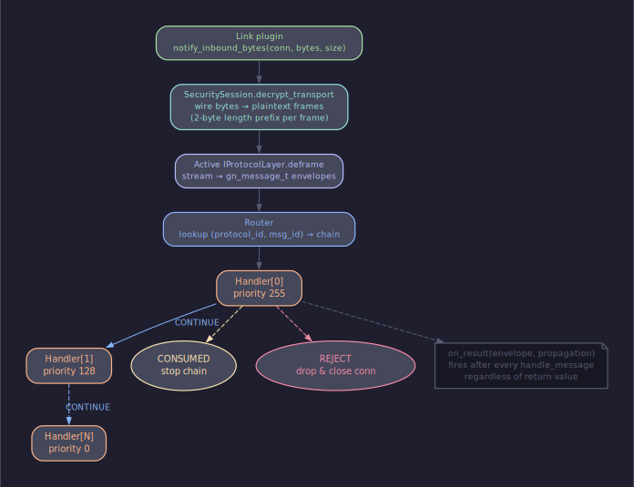
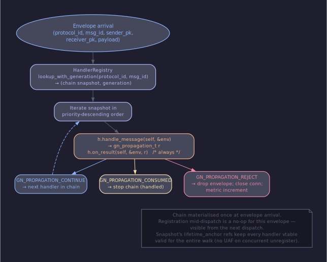
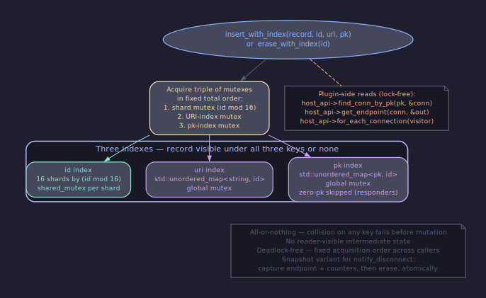
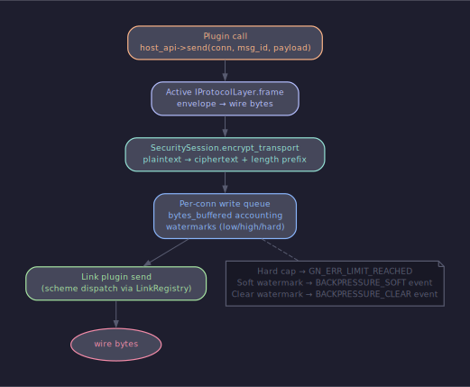

# Архитектура: маршрутизация сообщений

## Содержание

- [Поток входящих байт](#поток-входящих-байт)
- [Адресация по public key](#адресация-по-public-key)
- [Диспетчер хендлеров](#диспетчер-хендлеров)
- [Регистр соединений](#регистр-соединений)
- [Отправка наружу](#отправка-наружу)
- [Inject — мост для внешних систем](#inject--мост-для-внешних-систем)
- [URI и public key](#uri-и-public-key)
- [Backpressure при маршрутизации](#backpressure-при-маршрутизации)

---

## Поток входящих байт

GoodNet принимает байты из сокета и доводит их до вызова хендлера через
четыре линейных шага. Каждый шаг владеет своим уровнем абстракции и не
знает, что делает следующий.

Транспорт-плагин читает столько байт, сколько отдала ОС, и вызывает
`host_api->notify_inbound_bytes(conn, bytes, size)` — слот описан в
[host-api.md §2](../contracts/host-api.en.md). Транспорт никогда не парсит
содержимое и не знает о границах фреймов: один вызов может принести
половину фрейма, целый фрейм или несколько фреймов разом. Сегментация
сокета и логика фреймов разделены намеренно.

Дальше работает security-сессия. Она держит per-conn буфер для частично
прочитанных байт, снимает 2-байтовый length-prefix, который сама же
ставила на исходящем пути, и выдаёт ноль или больше plaintext-фреймов.
Если AEAD-тег не сходится — сессия возвращает ошибку, и ядро закрывает
соединение через `notify_disconnect`. Буфер ограничен per
[backpressure.md §9](../contracts/backpressure.en.md), так что злонамеренный
peer не может через медленную доставку байт удерживать память.

Plaintext попадает в активный protocol layer — единственный обязательный
слой ядра. Его метод `deframe(ctx, bytes, bytes_size, &out)` парсит ноль
или больше envelope-структур из потока и сообщает в `bytes_consumed`,
сколько байт ядро может выкинуть из буфера. Контракт описан в
[protocol-layer.md §3](../contracts/protocol-layer.en.md). Каждый
envelope — это `gn_message_t`: 32-байтовый sender_pk, 32-байтовый
receiver_pk, 4-байтовый msg_id, заимствованный указатель на payload и
размер. Указатель валиден только в пределах синхронного вызова хендлера.

После deframe ядро смотрит на `receiver_pk`. Если это адрес одной из
локальных идентичностей — диспетчер ищет цепочку хендлеров по
`(protocol_id, msg_id)` и проходит её сверху вниз. Если ZERO — это
broadcast, и цепочка отрабатывает на всех зарегистрированных хендлерах
этого msg_id. Если адрес чужой и relay-плагин не загружен — frame
отбрасывается со счётчиком `route.outcome.dropped_unknown_receiver` per
[protocol-layer.md §6](../contracts/protocol-layer.en.md).

---

## Адресация по public key

В GoodNet адресом узла служит 32-байтовый Ed25519 public key. Транспорт
несёт байты, security несёт шифр, но имя получателя — это ключ.

URI вида `tcp://1.2.3.4:9000` или `ipc:///run/goodnet.sock` описывает
**где находится сокет**, а не **кто там живёт**. Один peer может быть
доступен по нескольким URI одновременно (LAN-IP и публичный TLS-эндпоинт
к одному узлу), и оба URI должны разрешаться в один peer_pk. Контракт
URI-парсера живёт в [uri.md](../contracts/uri.en.md); парсер чистый, без
DNS, без процентного декодирования.

Адрес выводится из двух компонент по протоколу
[identity.md §3](../contracts/identity.en.md): user-keypair (долгоживущий,
портативный) и device-keypair (на устройство). HKDF-SHA256 по
конкатенации `user_pk || device_pk` со scoped salt
`goodnet/v1/address` даёт 32 байта мешевого адреса. Ротация
device-ключа меняет адрес — peer-ы должны искать соединения по ключу,
а не кешировать адрес между ротациями.

Плагины никогда не видят ни attestation-байтов, ни user-keypair, ни
device-seed. Поверхность идентичности для плагина — это две функции
аксессоров: `gn_ctx_local_pk(ctx)` и `gn_ctx_remote_pk(ctx)`. Обе
возвращают 32 байта. Всё, что под ними — детали ядра.

---

## Диспетчер хендлеров

Когда envelope готов, ядро ищет цепочку хендлеров и проходит её строго
по приоритетам.

Регистрация — через универсальный слот `register_vtable` со
`kind = GN_REGISTER_HANDLER`. Параметры handler-формы описаны в
[handler-registration.md §2](../contracts/handler-registration.en.md):
`protocol_id` (например, `"gnet-v1"`), `msg_id` (per-protocol
namespace), `priority` (0..255). Один и тот же `msg_id = 0x42` под
разными протоколами — независимы; namespace per protocol.

Цепочка ищется по паре `(protocol_id, msg_id)` и материализуется
один раз на envelope — регистрация во время прохода становится видна
только следующему диспетчу. Это устраняет гонки между диспетчем и
(un)регистрацией. Lookup опирается на RCU: мутации публикуют новый
read-only снапшот, читатели видят то, что было актуально на момент
входа.

Каждый хендлер в цепочке возвращает `gn_propagation_t`:

- `GN_PROPAGATION_CONTINUE` — следующий в цепочке тоже видит envelope.
- `GN_PROPAGATION_CONSUMED` — цепочка остановлена, дальше никто не
  получает.
- `GN_PROPAGATION_REJECT` — envelope отбрасывается, и соединение
  закрывается. Per [sdk/handler.h](../../sdk/handler.h).

Высокий приоритет видит envelope первым. Хендлер с `priority = 255`,
вернувший `CONSUMED`, лишает обзора всех с меньшим приоритетом. Равные
приоритеты разрешаются порядком регистрации: старшие — впереди.
Глубина цепочки на одну `(protocol_id, msg_id)` ограничена
`Limits::max_handlers_per_msg_id` (8 по умолчанию).

После каждого `handle_message` ядро вызывает `on_result` — независимо
от того, что хендлер вернул. Это надёжный хвост для счётчиков relay,
обновления DHT-bucket и любой пост-обработки. Слот может быть NULL,
если хендлеру нечего там делать. См.
[handler-registration.md §5](../contracts/handler-registration.en.md).

Хендлеры, чувствительные к input-edge соединению, читают
`envelope->conn_id` напрямую вместо того, чтобы резолвить
`sender_pk` через `find_conn_by_pk`. На relay-путях `sender_pk` — это
оригинатор, а conn — это узел-транзит; pk-индекс не даст связи между
ними. Контракт обязателен: handler MUST tolerate `GN_INVALID_ID` как
`CONTINUE` per [handler-registration.md §3a](../contracts/handler-registration.en.md).

---

## Регистр соединений

Соединения адресуемы по трём ключам: numeric `conn_id`, URI, public
key. Каждый ключ должен указывать в одну и ту же запись в каждый
наблюдаемый момент — либо ни в какую. Без координации три отдельных
лока на трёх отдельных индексах допускают окно, в котором читатель
видит запись под одним ключом и пустоту под двумя другими.

Регистр шардирован внутренне по `id mod 16` через 16 шардов. Это
максимальный fan-out, который не упирается в contention на захвате
shard-mutex под устойчивой multi-Gbps нагрузкой. Число —
имплементационная деталь; плагины от него не зависят.

Атомарная вставка `insert_with_index` per
[registry.md §3](../contracts/registry.en.md) выполняется так:

1. Захватить shard-mutex для `id`, URI-index-mutex и pk-index-mutex
   в фиксированном глобальном порядке. Это единственный механизм
   избежания дедлоков; конкурентные вставки той же тройки берут
   локи идентично.
2. Проверить, что каждый индекс свободен от предлагаемого ключа. Если
   хоть один занят — отпустить все локи и вернуть
   `GN_ERR_LIMIT_REACHED`. Никаких частичных состояний.
3. Вставить запись в shard, направить URI-индекс на неё, направить
   pk-индекс на неё.
4. Отпустить локи.

Атомарный erase — зеркало вставки. Cnt: захватить ту же тройку в том
же порядке, найти запись по id (если её нет — отпустить и вернуть
`GN_ERR_NOT_FOUND`), удалить из URI-индекса, pk-индекса, shard-а,
отпустить.

Плагины наблюдают записи через host-API: `find_conn_by_pk(pk, &conn)`
возвращает `conn_id` или `GN_ERR_NOT_FOUND`; `get_endpoint(conn, &out)`
пишет в caller-allocated `gn_endpoint_t` снимок: pk, URI, trust,
link-scheme, счётчики байт и фреймов, RTT. Эти чтения не блокируют
ядро. Stale reads допустимы: соединение могло закрыться между
чтением и использованием. См. полный layout в
[registry.md §8](../contracts/registry.en.md).

Connection ids аллоцирует **только ядро**. Транспорты не выдумывают
свои — там, где транспорту нужен local correlator (ICE-session id),
он живёт в transport-private state и мапится в kernel-allocated id
ровно один раз на `notify_connect`.

---

## Отправка наружу

Исходящий путь — зеркало входящего, но в обратном порядке.

Приложение или хендлер вызывает `host_api->send(conn, msg_id, payload,
size)`. Ядро находит запись соединения по `conn_id`, читает с него
активный protocol layer и зовёт `frame(ctx, msg, &out_bytes,
&out_size, &out_user_data, &out_free)` per
[sdk/protocol.h](../../sdk/protocol.h). Plugin аллоцирует heap-буфер с
сериализованными байтами и возвращает функцию-деструктор, которую
ядро позовёт после того, как байты дойдут до security.

Security-сессия принимает plaintext, шифрует AEAD, ставит 2-байтовый
length-prefix и отдаёт байты транспорту. Транспорт ставит их в
write-queue per-conn. Если очередь переполнена выше hard-cap —
`host_api->send` возвращает `GN_BP_HARD_LIMIT`, и producer обязан
откатиться, не повторять в tight-loop. См.
[backpressure.md §3](../contracts/backpressure.en.md).

Identity sources на исходящем пути:

| Сценарий | sender_pk | receiver_pk |
|---|---|---|
| Direct mesh-native | `ctx.local.public_key` | caller-specified |
| Broadcast (gossip) | `ctx.local.public_key` | ZERO |
| Relay-transit | preserved end-to-end | preserved end-to-end |
| Inject-external (bridge) | caller-specified | caller-specified |

Per [protocol-layer.md §5](../contracts/protocol-layer.en.md). На relay-
путях узел-транзит **не переписывает** ни sender, ни receiver —
end-to-end identity сохраняется.

---

## Inject — мост для внешних систем

Bridge-хендлеры подключают к мешу внешние системы (MQTT, HTTP,
foreign mesh). Внешняя система не имеет своей Ed25519-идентичности;
bridge — у которого она есть — переиздаёт входящие foreign-payload
под своей идентичностью через слот `inject` per
[host-api.md §8](../contracts/host-api.en.md).

Два уровня инжекта:

- `GN_INJECT_LAYER_MESSAGE` — bridge даёт msg_id и payload-байты;
  ядро строит envelope `(sender_pk = source.remote_pk, receiver_pk =
  local_identity, msg_id, bytes)` и пускает его через router как
  если бы байты пришли с source-соединения. `msg_id` обязан быть
  ненулевым.
- `GN_INJECT_LAYER_FRAME` — bridge передаёт уже сформированный
  wire-side frame; ядро отдаёт его в `deframe` активного protocol
  layer и диспетчит envelope-ы, которые тот выдаст. `msg_id`
  игнорируется. Используется relay-style туннелями.

Оба уровня штампуют `gn_message_t::conn_id = source` на каждом
диспетчируемом envelope, чтобы conn-aware хендлеры (heartbeat RTT,
per-link-гейты) могли читать `env.conn_id` напрямую и слать ответ
обратно через `send(source, ...)`.

Inject — **не** даунгрейд от peer-direct delivery. `sender_pk` —
это remote_pk source-соединения, signed metadata неизменна, trust
class остаётся таким же, как у source. Bridge не может через
inject повысить свой trust.

Per-source rate limiting — token bucket: 100 сообщений/сек, burst
50. Bucket key — первые 8 байт `remote_pk` source-соединения. LRU
ограничивает map в 4096 entries; неограниченный рост source-id не
исчерпает память.

---

## URI и public key

URI — это transport address. Public key — это node identity.
Соответствие N:1: один peer_pk может быть доступен по нескольким
URI; один URI указывает строго на одно соединение в данный момент.

URI-парсер чистый: scheme, host, port, path, query. Контракт
[uri.md](../contracts/uri.en.md) перечисляет recognised forms,
канонизацию (стрипает query, ре-брекетит IPv6 без скобок), failure
modes (port=0 на dial-стороне, control-bytes 0x00–0x20 и 0x7F
отвергаются up front).

Канонизация важна для регистра: два URI эквивалентны iff их
canonical forms байт-равны. `tcp://1.2.3.4:80` и `tcp://1.2.3.4:8080`
— разные ключи. Substring-matching как lookup-pattern запрещён.

Query-string `?peer=<hex>` — один зарезервированный ключ. Парсер
[`core/util/uri_query.hpp::parse_peer_param`](../../core/util/uri_query.hpp)
декодирует hex в X25519-pk; используется для IK-preset инициатора в
Noise-handshake.

---

## Backpressure при маршрутизации

Producer, пихающий байты в транспорт быстрее, чем ОС-сокет их
дренирует, должен быть проинформирован. Контракт
[backpressure.md](../contracts/backpressure.en.md) определяет три
наблюдаемых уровня в порядке от немедленного к advisory:

| Уровень | Триггер | Сигнал |
|---|---|---|
| Hard cap | bytes_buffered + payload > `pending_queue_bytes_hard` | `host_api->send` возвращает `GN_BP_HARD_LIMIT` |
| Soft watermark | bytes_buffered crosses `pending_queue_bytes_high` | event `BACKPRESSURE_SOFT` на conn-event channel |
| Clear watermark | bytes_buffered drops below `pending_queue_bytes_low` | event `BACKPRESSURE_CLEAR` |

Гистерезис между low и high удерживает сигнал от осцилляций. Дефолт:
256 KiB low / 1 MiB high / 4 MiB hard. Cross-field инвариант
`0 < low < high ≤ hard` валидируется на `Config::validate`.

Подписка на backpressure-events — через `host_api->subscribe(
GN_SUBSCRIBE_CONN_EVENTS, cb, user_data, &id)`. Producer, получивший
SOFT, обязан замедлиться; producer, проигнорировавший SOFT и
получивший HARD_LIMIT, обязан откатиться, а не повторять в
tight-loop. Это единственное место в host-API, где у плагина есть
прямая обратная связь по нагрузке: ядро не оркестрирует send-rate,
оно только публикует факты.
