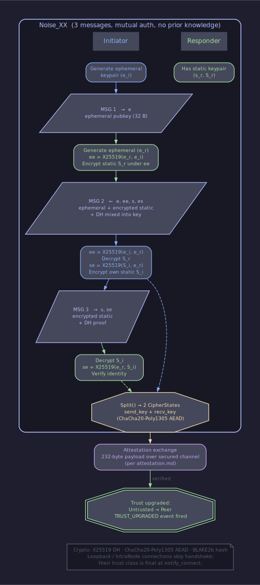
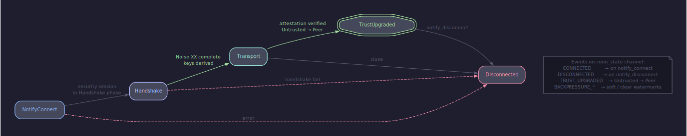
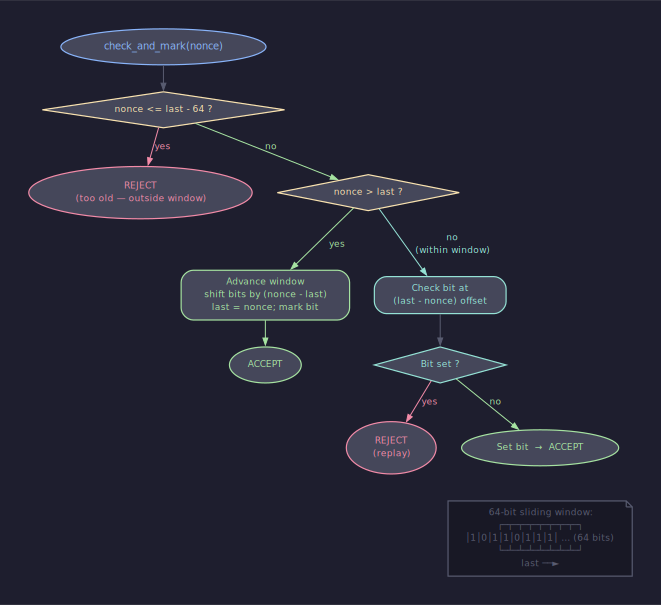

# Архитектура: жизненный цикл безопасности соединения

## Содержание

- [Слои безопасности](#слои-безопасности)
- [Trust classes](#trust-classes)
- [Handshake (Noise XX)](#handshake-noise-xx)
- [Connection FSM по фазам безопасности](#connection-fsm-по-фазам-безопасности)
- [Аттестация](#аттестация)
- [Single-active-provider invariant](#single-active-provider-invariant)
- [Replay protection](#replay-protection)
- [Identity vs trust](#identity-vs-trust)
- [Application visibility events](#application-visibility-events)
- [Plugin separation](#plugin-separation)
- [Cross-refs](#cross-refs)

---

## Слои безопасности

Соединение проходит три независимых слоя, прежде чем приложение
получает право обмениваться сообщениями. Каждый слой отвечает за свою
часть гарантии и не подменяет соседние.

**Session-level handshake.** Между транспортным `notify_connect` и
первым прикладным envelope ядро прогоняет соединение через активный
security-provider. Канонический provider — Noise XX, поставляемый
плагином `security/noise`; его vtable
([`sdk/security.h`](../../sdk/security.h)) выполняет
`handshake_open → handshake_step → export_transport_keys` и переводит
сессию в фазу `Transport`. До этого момента ни один прикладной
handler не видит ни одного байта.

**Attestation gate.** Завершённый Noise доказывает только владение
static-ключом. Чтобы подтвердить, что этот static подписан длинным
user-ключом узла, оба пира обмениваются 232-байтовым attestation-
пакетом по уже зашифрованному каналу. Пока attestation не
проверилась с обеих сторон, соединение остаётся в trust-классе
`Untrusted`.

**Trust class.** После успешной аттестации kernel переводит
соединение из `Untrusted` в `Peer` — единственный разрешённый upgrade
в системе. Прикладные handler'ы читают итоговый trust через
`gn_endpoint_t::trust` и принимают решения о маршрутизации
(relay-плагин: «можно ли пробросить сообщение от `Untrusted` к
`Peer`»; storage-плагин: «можно ли записать на диск пейлоад с этого
соединения»).

Слои образуют последовательность, не альтернативы: handshake без
аттестации не даёт `Peer`, аттестация без handshake невозможна
(channel-binding `handshake_hash` физически отсутствует), trust
без обоих остаётся `Untrusted`.

---

## Trust classes

Тип [`gn_trust_class_t`](../../sdk/trust.h) перечисляет ровно четыре
значения, упорядоченных по возрастанию доверия:

| Класс | Источник | Может ли upgrade'нуться |
|---|---|---|
| `Untrusted` | TCP/UDP/WS с публичного адреса; по умолчанию для inbound | да, в `Peer` через аттестацию |
| `Peer` | результат успешного `Untrusted → Peer` upgrade'а | нет, terminal |
| `Loopback` | TCP/UDP с `127.0.0.1`/`::1`, IPC через Unix socket | нет, finalized at `notify_connect` |
| `IntraNode` | внутри-процессный pipe между плагинами одного ядра | нет, finalized at `notify_connect` |

Предикат `gn_trust_can_upgrade(from, to)`
([sdk/trust.h](../../sdk/trust.h)) кодирует единственный разрешённый
переход:

```c
if (from == GN_TRUST_UNTRUSTED && to == GN_TRUST_PEER) return 1;
return from == to;
```

Любой другой переход отклоняется. В частности kernel **никогда** не
понижает trust в течение жизни соединения. Скомпрометированный пир
не может «откатиться» из `Peer` обратно в `Untrusted` — соединение
закрывается целиком и пересоздаётся заново. `Loopback` и
`IntraNode` — финальные классы: их назначает транспорт на этапе
`notify_connect`, attestation gate их не касается, downgrade не
существует.

Подробности гейта — [security-trust.md §3](../contracts/security-trust.md).

---

## Handshake (Noise XX)

Канонический pattern — Noise_XX_25519_ChaChaPoly_SHA256, три сообщения
со взаимной аутентификацией и forward secrecy. Initiator и
responder выполняют симметричный обмен; static-ключи не передаются
до тех пор, пока обе стороны не убедились, что у соседа есть
ephemeral.



| Шаг | Отправитель | Содержимое | Эффект |
|---|---|---|---|
| msg 1 | initiator | `e_pub` | responder узнаёт ephemeral initiator'а |
| msg 2 | responder | `e_pub`, `s_enc`, `ee || es` MAC | initiator получает static responder'а |
| msg 3 | initiator | `s_enc`, `se` MAC | responder получает static initiator'а |

После msg 3 оба пира вызывают `export_transport_keys`, получают
симметричные `send_cipher_key` / `recv_cipher_key` плюс 32-байтовый
`handshake_hash` (channel binding для последующей аттестации) и
переходят в фазу `Transport`. Wire-формат ChaCha20-Poly1305 с
2-байтовым big-endian length-префиксом per-frame описан в SDK-
плагина noise (см. `plugins/security/noise/docs/handshake.md` §7);
ядро видит только vtable и не зашивает константы pattern'а.

Initiator'а раскачивает явный `kick_handshake`-вызов, который link-
плагин делает после регистрации сокета под свежевыданным
`gn_conn_id_t`. Это разделено с `notify_connect`, чтобы исходящие
байты не успели уйти раньше, чем link знает, куда возвращать
incoming-байты.

---

## Connection FSM по фазам безопасности

С точки зрения kernel'а соединение проходит пять состояний.
Подписчики `subscribe_conn_state` видят переходы как события из
[conn-events.md](../contracts/conn-events.md).



**NotifyConnect.** Транспорт вызывает `notify_connect` с заявленным
trust-классом и handshake-ролью. Kernel выделяет `gn_conn_id_t`,
создаёт `SecuritySession` через `SessionRegistry::create`, проверяет
trust против маски активного security-provider'а (см. §
[Single-active-provider invariant](#single-active-provider-invariant))
и публикует `GN_CONN_EVENT_CONNECTED`.

**Handshake.** Сессия в фазе `Handshake`. Каждый
`notify_inbound_bytes` прогоняется через `advance_handshake`;
исходящие плейнтекст-фреймы, которые приложение успело отправить до
завершения, буферизуются в `pending_` (per
[backpressure.md §8](../contracts/backpressure.md)) и
выливаются в транспорт после перехода в `Transport`.

**Transport.** `handshake_complete` вернул 1, transport-keys
экспортированы, фаза `Transport`. `encrypt_transport` /
`decrypt_transport_stream` теперь обрабатывают каждый
прикладной фрейм. Соединение всё ещё в `Untrusted` — attestation
gate не пройден.

**TrustUpgraded.** Attestation dispatcher завершил mutual exchange
(оба `our_sent` и `their_received_valid` подняты). Kernel вызывает
`connections.upgrade_trust(conn, GN_TRUST_PEER)` и публикует
`GN_CONN_EVENT_TRUST_UPGRADED`. Это единственная возможная точка,
где trust меняется на жизни соединения.

**Disconnected.** Любой шаг — handshake fail, attestation fail, link
disconnect, явный `host_api->disconnect` — приводит сессию в
`Closed`, регистр снимает запись, публикуется
`GN_CONN_EVENT_DISCONNECTED`. Состояние не возвращается; повторное
соединение начинает заново.

---

## Аттестация

После перехода сессии в `Transport` kernel-internal attestation
dispatcher автоматически собирает 232-байтовый payload (плагины не
участвуют). Layout:

| Offset | Size | Поле |
|---|---|---|
| 0     | 136 | attestation cert per [identity.md §4](../contracts/identity.md) |
| 136   | 32  | binding — текущий `handshake_hash` сессии |
| 168   | 64  | Ed25519 signature над `attestation \|\| binding` |

Cert содержит `user_pk`, `device_pk`, `expiry_unix_ts` и подпись
user-секретом над префиксом. Binding пинит cert к этой
конкретной сессии: replay захваченного cert'а в новой сессии даёт
несовпадение `handshake_hash` и отклоняется на шаге 3 consumer-
проверки.

Receiver проходит семь шагов
([attestation.md §5](../contracts/attestation.md)): размер,
layout-split, binding-match, parse, signature verify, cert verify,
identity stability против `ConnectionRegistry::pinned_device_pk`.
Любой отказ закрывает соединение с конкретным
`gn_drop_reason_t` — `GN_DROP_ATTESTATION_BAD_SIGNATURE`,
`GN_DROP_ATTESTATION_REPLAY`, `GN_DROP_ATTESTATION_IDENTITY_CHANGE`
и так далее. Метрика `attestation.<reason>` инкрементится; шум на
ней — сигнал оператору о попытке атаки или поломке часов.

Connection без аттестации остаётся `Untrusted` неограниченно — kernel
v1 не вводит wait-time bound. Plugin'ы, которым нужен deadline,
закрывают соединение через `host_api->disconnect` сами.
`Loopback` и `IntraNode` пропускают весь шаг — их trust
финализирован на `notify_connect`.

---

## Single-active-provider invariant

`SecurityRegistry` хранит ровно одного активного security-provider'а
на всё ядро. Второй вызов `register_security` возвращает
`GN_ERR_LIMIT_REACHED` без вытеснения существующего
([security-trust.md §6](../contracts/security-trust.md)). Это
гарантирует, что в node lifetime есть единственная конкретная
crypto-реализация, которую может видеть оператор.

На каждый трансклаcс существует одна допустимая комбинация:

- `Untrusted` / `Peer` обслуживаются провайдером, чей
  `allowed_trust_mask` включает соответствующий бит. У noise
  маска — все четыре класса; у null — только `Loopback | IntraNode`.
- Попытка завести соединение в классе, который провайдер не
  принимает, отклоняется на `SessionRegistry::create` с
  `GN_ERR_INVALID_ENVELOPE` и инкрементом
  `metrics.drop.trust_class_mismatch`.

Эта инвариантность опирается на `register_security` как на единственную
точку входа. Plugin не может обойти регистр — kernel не линкует ни
одного провайдера статически, в `core/` лежат только заголовки
интерфейса. Источник конкретики — всегда загруженный плагин.

В v1.x запланирован `StackRegistry` с per-trust-class селекцией
(null для `Loopback`, noise для `Peer` на одном узле); до тех пор
single-active — основной режим.

---

## Replay protection

Транспортная фаза защищена от replay атак на двух уровнях. На уровне
AEAD nonce монотонно увеличивается per-direction; повторное
получение ciphertext с уже принятым nonce ломает Poly1305-tag и
отклоняется провайдером.

Поверх AEAD kernel поддерживает sliding window для out-of-order
доставки: nonce в окне `[max_received - W, max_received]`
принимается, если ранее не был отмечен; nonce ниже окна —
отбрасывается.



Размер окна — деталь провайдера (noise-плагин использует 64).
Window реализуется битовой маской, амортизированная стоимость
проверки — O(1). Подробности в
[security-trust.md §6](../contracts/security-trust.md).

Attestation flow добавляет ещё один уровень replay-защиты:
binding-поле в payload фиксирует `handshake_hash`, и попытка
переслать захваченный attestation в новую сессию даёт
несовпадение binding'а на consumer step 3 и закрывает соединение
с `GN_DROP_ATTESTATION_REPLAY`.

---

## Identity vs trust

Identity и trust — ортогональные понятия. Их легко спутать, потому что
оба измеряются в Ed25519-ключах, но играют разные роли.

**Local identity** — пара `(user_keypair, device_keypair)`,
загружаемая из `data/`. Это «кто я» — длинный user-ключ,
переживающий замены устройств, плюс per-device ключ, который
никогда не покидает машину. Mesh-адрес узла —
`HKDF("goodnet/v1/address", user_pk || device_pk)` per
[identity.md §3](../contracts/identity.md). Plugin'ы видят
только итоговый 32-байтовый `gn_ctx_local_pk`; кейпейры лежат в
ядре и не пересекают plugin boundary.

**Trust class** — это «как ядро относится к этому конкретному
соединению». Один и тот же local identity может одновременно
держать соединения в `Peer`, `Untrusted` и `Loopback` — trust
зависит не от того, кто ты, а от того, кто на другом конце и через
какой канал. Перезагрузка узла не меняет identity, но обнуляет все
trust'ы — каждое новое соединение проходит handshake и attestation
заново.

Identity rotation
([identity.md §6a](../contracts/identity.md)) меняет
local identity мгновенно через atomic shared_ptr swap, но trust на
существующих соединениях остаётся прежним: kernel не разрывает их.
Новые соединения открываются под новым device_pk.

---

## Application visibility events

Канал `subscribe_conn_state` — единственная точка, через которую
plugin наблюдает за фазами безопасности соединения. Kernel
публикует туда:

- `GN_CONN_EVENT_CONNECTED` — после `notify_connect`
- `GN_CONN_EVENT_TRUST_UPGRADED` — после успешной mutual attestation
- `GN_CONN_EVENT_BACKPRESSURE_SOFT` / `BACKPRESSURE_CLEAR` — пересечение
  watermark'ов очереди
- `GN_CONN_EVENT_DISCONNECTED` — закрытие, с `gn_result_t reason`

Плагины используют эти события, не дёргая внутренности ядра. Relay-
плагин подписан на `TRUST_UPGRADED`, чтобы переключить трафик с
relay-через-промежуточный-узел на direct, как только появилась
прямая верифицированная связь. Storage-плагин ждёт
`TRUST_UPGRADED` перед сохранением payload'а на диск.
Heartbeat подписан на `CONNECTED` для запуска первого PING'а.

`gn_drop_reason_t` для attestation/security drops пока не
лифтится в отдельный event-channel; v1 публикует их как warn-
строки в structured log плюс метрику. Канал
`drop_reason → counter` запланирован на минорный релиз.

---

## Plugin separation

Конкретные security-провайдеры — `security/noise` и `security/null` —
живут каждый в своём git-репозитории под `plugins/security/`,
собираются как отдельные `.so`, грузятся через `dlopen` после проверки
SHA-256-манифеста. Kernel содержит только декларацию
`gn_security_provider_vtable_t` и runtime registry; конкретного
провайдера он узнаёт только через `register_security` от
загруженного плагина.

Это даёт два важных свойства. Во-первых, plaintext-путь физически
недостижим source-level reachability: оператор, не загрузивший null-
плагин, не получит null security даже под отладкой. Во-вторых, замена
провайдера не требует пересборки ядра — заменяется только `.so` и
обновляется `plugins.security` в конфиге.

Wire-детали Noise — формат сообщений, длина префикса, размер тэга,
nonce derivation — лежат в SDK noise-плагина и никогда не появляются
в kernel-коде. Если завтра понадобится provider на основе TLS 1.3-PSK
или экспериментального post-quantum pattern'а, он встаёт ровно в ту
же vtable без правок ядра.

Подробности устройства плагина и схема загрузки — в
[plugin-model](./plugin-model.md).

---

## Cross-refs

- [security-trust.md](../contracts/security-trust.md) — trust-class policy,
  per-component admission masks, conn-id ownership gate
- [attestation.md](../contracts/attestation.md) — wire payload, consumer
  steps, drop reasons
- [identity.md](../contracts/identity.md) — two-component identity,
  address derivation, attestation cert format
- [conn-events.md](../contracts/conn-events.md) — channel и kinds
- [host-api.md](../contracts/host-api.md) §2 — `register_security`,
  `notify_connect`, `kick_handshake`, `subscribe_conn_state`
- [overview](./overview.md) — зоны ответственности и границы
- [extension-model](./extension-model.md) — координация плагинов поверх
  trust-событий
- [plugin-model](./plugin-model.md) — упаковка `.so`, manifest, dlopen
