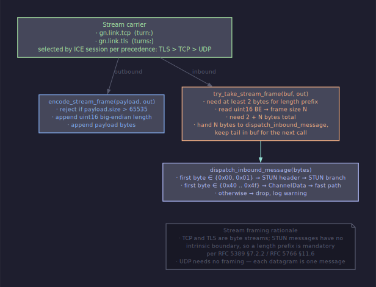

# Архитектура: формат байтов на проводе

<!-- livedoc:embed_turn_stream_framing -->
<!-- generated by tools/livedoc.py — do not edit by hand; rerun `make livedoc` to refresh -->



_TURN-over-TCP / TLS 16-bit length-prefix framing path._
<!-- /livedoc:embed_turn_stream_framing -->


## Содержание

- [Mesh-framing — единственный обязательный слой](#mesh-framing--единственный-обязательный-слой)
- [Envelope как kernel-side структура](#envelope-как-kernel-side-структура)
- [Формат gnet-фрейма](#формат-gnet-фрейма)
- [Кодирование](#кодирование)
- [Decoding и coalescing](#decoding-и-coalescing)
- [Три режима кодирования](#три-режима-кодирования)
- [raw protocol — opaque-passthrough](#raw-protocol--opaque-passthrough)
- [Capability TLV над application-сообщениями](#capability-tlv-над-application-сообщениями)
- [Length-prefix инварианты](#length-prefix-инварианты)
- [Длина и backpressure](#длина-и-backpressure)
- [Эволюция wire-протокола](#эволюция-wire-протокола)
- [Cross-references](#cross-references)

---

## Mesh-framing — единственный обязательный слой

В GoodNet протокольный слой — единственная точка, где байты с провода
становятся типизированными envelope-структурами. Контракт
[protocol-layer.md](../contracts/protocol-layer.en.md) пинит это:
бинарь ядра статически линкует **ровно одну** реализацию
`IProtocolLayer`, и `target_link_libraries(kernel PUBLIC <impl>)`
выбирает её на этапе сборки. Мультипимпл рантайм-выбор не
поддерживается.

Дефолтная реализация — `gnet-v1` в
`plugins/protocols/gnet/`. Альтернатива для симуляционных стендов и
PCAP-replay — `raw-v1` в `plugins/protocols/raw/`. Оба плагина —
kernel-internal: их CMake-цели линкуются в kernel binary, а не
грузятся через `dlopen`. Это не loadable плагины.

Почему статически? Рантайм-селекция mesh-framing создаёт wire-format
ambiguity на peer-to-peer handshake. Один узел — один mesh-format.
Эволюция через cut-release с deprecation: добавляем `mesh-v2`
рядом, собираем kernel с `-DGOODNET_MESH_LAYER=mesh-v2`, выпускаем
переходный релиз с обоими бинарями, дропаем `gnet-v1` после миграции
экосистемы.

Ядро никогда не парсит байты само. Любая константа wire-формата
живёт в плагине; `core/` агностично.

---

## Envelope как kernel-side структура

После `deframe` ядро держит `gn_message_t` — структура из
[sdk/types.h](../../sdk/types.h):

```c
typedef struct gn_message_s {
    uint32_t       api_size;          /* sizeof(gn_message_t) */
    uint8_t        sender_pk[32];     /* Ed25519, end-to-end */
    uint8_t        receiver_pk[32];   /* ZERO ⇒ broadcast    */
    uint32_t       msg_id;            /* per-protocol routing */
    const uint8_t* payload;           /* borrowed             */
    size_t         payload_size;
    gn_conn_id_t   conn_id;           /* inbound-edge conn    */
    void*          _reserved[4];
} gn_message_t;
```

Поля заполняются плагином из связки `wire + ConnectionContext`. На
direct-соединении plain bytes уже постноисовы, peer-pk известен из
handshake — сериализовать его на провод не нужно. Sender и receiver
заполняются из `gn_ctx_remote_pk(ctx)` и `gn_ctx_local_pk(ctx)`. На
broadcast и relay — из wire (см. флаги ниже).

`payload` — заимствованный указатель в input-буфер; валиден только в
пределах синхронного `handle_message`. Хендлер, которому нужны байты
после возврата, копирует.

`receiver_pk = ZERO` означает broadcast. `sender_pk = ZERO`
запрещён: envelope с нулевым отправителем дропается на ингрессе и
учитывается в `route.outcome.dropped_zero_sender` per
[protocol-layer.md §2.3](../contracts/protocol-layer.en.md) —
имя шарит routing-pipeline namespace, operator scrape'ит один префикс
для всех drop'ов на dispatch chain.

`msg_id` — per-protocol namespace. `0x00` — зарезервированный
sentinel и отвергается при регистрации хендлера. `0x11` —
attestation dispatcher per
[handler-registration.md §2a](../contracts/handler-registration.en.md).

---

## Формат gnet-фрейма

Wire-format v1 — фиксированный 14-байтовый header плюс условные
public-key поля плюс payload. Все multi-byte integers —
**big-endian**. Полная спецификация — в
[wire-format.md](../../plugins/protocols/gnet/docs/wire-format.md).

```
offset  size  field        value / meaning
------  ----  -----------  ----------------------------------------------
  0      4    magic        0x47 0x4E 0x45 0x54  ('G' 'N' 'E' 'T')
  4      1    ver          0x01 для этого контракта
  5      1    flags        bitfield, see §flags
  6      4    msg_id       uint32 — routing target inside receiver
 10      4    length       uint32 — total frame size including this
                           header and any conditional fields below
```

Условные поля присутствуют по битам флагов:

```
offset    size  field           present when
--------  ----  --------------  ----------------------------------
 14       32    sender_pk       (flags & 0x01) != 0  — EXPLICIT_SENDER
 14|46    32    receiver_pk     (flags & 0x02) != 0  — EXPLICIT_RECEIVER
```

Порядок фиксирован: sender_pk предшествует receiver_pk при наличии
обоих.

Payload идёт сразу после условной области:

```
14 + cond_pk_size  →  length - header_size  →  payload
```

где `cond_pk_size = 32 * popcount(flags & 0x03)` и
`header_size = 14 + cond_pk_size`.

### Биты флагов

```
bit  mask   name                  meaning
---  ----   --------------------  ----------------------------------
 0   0x01   EXPLICIT_SENDER       sender_pk на проводе
 1   0x02   EXPLICIT_RECEIVER     receiver_pk на проводе
 2   0x04   BROADCAST             receiver = ZERO; SENDER должен быть
                                  EXPLICIT; RECEIVER должен быть 0
 3   0x08   reserved              MUST be 0 в v1
 4-7 0xF0   reserved              MUST be 0 в v1
```

Reserved bits, выставленные на ингрессе → frame дропается, метрика
`gnet.dropped.reserved_bit`, без закрытия соединения. Это канал
для wire-additive эволюции: новый бит становится осмысленным в
новой реализации, игнорируется в старой.

---

## Кодирование

Endianness — network big-endian для всех multi-byte полей. Padding
отсутствует: header tightly-packed, conditional pk области идут
встык, payload идёт сразу за ними. Каждый байт wire-frame участвует
в семантике; никаких выравниваний.

Maximum frame size — `2^16 = 65536` байт, включая header и
conditional fields. Это совпадает с дефолтным
`gn_limits_t::max_frame_bytes`. Frame с `length > 65536` ядро
отвергает с `GN_ERR_FRAME_TOO_LARGE`, даже хотя `uint32` позволял
бы больше — это совпадает с `IProtocolLayer::max_payload_size()`,
который возвращает `65536 - header_size`.

Plugin вычисляет `compute_frame_size(flags, payload_size) =
kFixedHeaderSize + 32 * popcount_explicit(flags) + payload_size`
перед `frame()`-вызовом, аллоцирует heap-буфер ровно нужного
размера и пишет байты по offset-у. Деструктор-pointer
возвращается через `out_free` — ядро вызовет его после того, как
байты дойдут до security.

---

## Decoding и coalescing

Транспорт стрим-класса (TCP, IPC, TLS-over-TCP) доставляет любой
размер чанка: один `notify_inbound_bytes` может принести половину
фрейма, целый фрейм или несколько фреймов. Это явно описано в
[host-api.md §2](../contracts/host-api.en.md): "the transport keeps
no per-call assumption about byte-to-frame correspondence".

`deframe(self, ctx, bytes, bytes_size, &out)` возвращает
`gn_deframe_result_t`:

```c
typedef struct gn_deframe_result_s {
    uint32_t            api_size;
    const gn_message_t* messages;        /* zero or more envelopes */
    size_t              count;
    size_t              bytes_consumed;  /* wire bytes ядро может
                                            выкинуть из буфера */
    void*               _reserved[4];
} gn_deframe_result_t;
```

`messages` — plugin-owned storage; `payload` указатели заимствуют у
input `bytes`. `bytes_consumed` сообщает ядру, сколько байт буфера
обработано; остаток будет передан снова на следующем вызове, когда
прибудут новые байты.

Парсер реализован как конечный автомат. Состояние `DECLARED`:
накопить 14 байт, проверить magic = `'GNET'`, проверить ver = 0x01,
проверить, что reserved-бит = 0, проверить, что
`BROADCAST → EXPLICIT_SENDER && !EXPLICIT_RECEIVER`. Перейти в
`READING_BODY`. Состояние `READING_BODY`: накопить total `length`
байт, заполнить `gn_message_t`, эмитировать envelope, продвинуть
курсор на `length`, вернуться в `DECLARED`.

Partial frames: deframer возвращает `bytes_consumed = 0`, пока хотя
бы один полный фрейм не собран. Ядро буферизует, дожидается
следующего notify, перезапускает.

---

## Три режима кодирования

GoodNet использует флаги для трёх explicit-режимов, оптимизированных
по overhead:

### Direct (самый частый, самый компактный)

Соединение peer-to-peer; обе стороны знают peer-pk друг друга после
Noise-handshake. Нет смысла нести pk на проводе.

```
flags = 0x00
total = 14 + payload
sender_pk    = ctx.remote     (заполняется из ConnectionContext)
receiver_pk  = ctx.local.pk   (заполняется из ConnectionContext)
```

Overhead: **14 байт** на фрейм.

### Broadcast (gossip, heartbeat, neighbour-discovery)

Originator идёт на проводе и сохраняется через transit-узлы;
получатель — ZERO, kernel выводит из BROADCAST-флага.

```
flags = 0x01 | 0x04 = 0x05  (EXPLICIT_SENDER | BROADCAST)
total = 14 + 32 + payload
sender_pk на проводе
receiver_pk = ZERO (implicit)
```

Overhead: **46 байт** на фрейм.

### Relay-transit

Используется relay-extension, когда узел-транзит передаёт от имени
другого peer. End-to-end identity сохраняется на проводе.

```
flags = 0x01 | 0x02 = 0x03  (EXPLICIT_SENDER | EXPLICIT_RECEIVER)
total = 14 + 32 + 32 + payload
sender_pk    на проводе  (originator, NOT rewritten by transit)
receiver_pk  на проводе  (final destination)
```

Overhead: **78 байт** на фрейм.

### Relay capability как opt-in

Peer, не получивший relay-capability, не может ставить
`EXPLICIT_SENDER`/`EXPLICIT_RECEIVER`/`BROADCAST` на ингрессе.
Deframer читает `gn_connection_context_t::allows_relay`; если false,
inbound frame с любым из этих флагов отвергается с
`GN_ERR_INTEGRITY_FAILED`. Без этой защиты peer мог бы спуфить
произвольный sender_pk и компрометировать хендлеры, аутентифицирующие
по отправителю; либо перенаправлять диспетч на чужую receiver_pk,
которой он не владеет.

---

## raw protocol — opaque-passthrough

`raw-v1` — второй static plugin под `plugins/protocols/raw/`.
Build-time альтернатива `gnet-v1` для трёх рабочих нагрузок:

- **Симуляционный стенд** — драйв ядра без overhead-а GNET-фрейминга
  в детерминированных тестах.
- **PCAP replay** — захваченные фреймы скармливаются ядру для
  оффлайн-анализа без построения синтетического транспорта.
- **Foreign-protocol passthrough** — bridge-плагины, у которых
  байты уже отфреймлены внешней системой, инжектят их через `raw`,
  чтобы ядро не накладывало GNET-header сверху.

`frame` пишет payload envelope verbatim; `deframe` производит ровно
один envelope, чей payload заимствует у input-буфера. Sender и
receiver заполняются из ConnectionContext. Никакого header-а
собственно у `raw-v1` нет — что пришло, то и видит next handler.

Trust policy жёсткая:
[security-trust.md §4](../contracts/security-trust.en.md) разрешает
`raw-v1` только на `GN_TRUST_LOOPBACK` и `GN_TRUST_INTRA_NODE`.
Deframe на любом другом trust class отвергается с
`GN_ERR_INVALID_ENVELOPE`. Opaque-passthrough на публичной сети
небезопасно по построению.

---

## Capability TLV над application-сообщениями

После того, как security-handshake достиг Transport-фазы, peer-ы
обмениваются списком опциональных возможностей. Контракт
[capability-tlv.md](../contracts/capability-tlv.en.md) пинит формат
**TLV-of-bitmap**: список type-length-value записей, где value
каждой записи — компактный bitmap, относящийся к одной категории.

```
record := type:u16  length:u16  value:length-bytes
blob   := record record record …
```

Оба `type` и `length` — big-endian. Blob — конкатенация записей без
терминатора. Length=0 легален и обозначает пустой value.

TLV-blob едет как payload application-сообщения с
зарезервированным msg_id `0x13`, **не** как отдельный
wire-формат. Ядро само blob не парсит — плагины encode/decode'ят
через header-only `sdk/cpp/capability_tlv.hpp` и шлют/принимают
через два host_api slot'а (`present_capability_blob`,
`subscribe_capability_blob`). Семантика и hard cap живут в
[capability-tlv.md](../contracts/capability-tlv.en.md).

Reserved type ranges:

| Range | Owner |
|---|---|
| `0x0000-0x00FF` | kernel-emitted records |
| `0x0200-0x0FFF` | core plugins |
| `0x1000-0x7FFF` | application records |
| `0x8000-0xFFFF` | experimental, не для production |

Initial allocations: `0x0000` — `transport-set` (bitmap транспортов
peer-а), `0x0001` — `protocol-set` (bitmap протоколов), `0x0002` —
`protocol-list` (UTF-8 newline-separated list, индекс — позиция бита
в protocol-set), `0x0200` — `heartbeat-interval-ms`.

Consumer, получивший unknown type, **обязан** пропустить запись
(advance на `length`) и продолжить парсинг. Это и есть additive-
эволюция: peer, узнавший про запись после релиза получателя, не
ломает получателя.

---

## Length-prefix инварианты

Wire frame несёт собственное `length` поле в 4-байтовом заголовке —
это total frame size, включая header и conditional fields. Поле
обязано точно равняться размеру frame на проводе. Несовпадение
обрабатывается так:

- `length < header_size` (при том, что header_size вычислен из
  flags) → `GN_ERR_DEFRAME_CORRUPT`. Ядро закрывает соединение,
  инкрементит metric `drop.deframe_corrupt`.
- `length > kMaxFrameBytes (65536)` → `GN_ERR_FRAME_TOO_LARGE`.
  Ядро закрывает соединение, инкрементит `drop.frame_too_large`.
  Отдельный код от `DEFRAME_CORRUPT`, чтобы оператор отличал
  hostile peer-а от случайного повреждения.

Кроме wire-frame length есть второй length-prefix — 2-байтовый
big-endian, который ставит security-сессия перед AEAD-цифертекстом
per [protocol-layer.md §6](../contracts/protocol-layer.en.md). Это
prefix для security-фрейма, не для GNET. Транспорт его не видит:
security сама собирает байты, выделяет prefix, декриптует, отдаёт
plaintext в protocol layer. Слой выше protocol layer видит только
opaque plaintext envelope; слой ниже видит только opaque transport
bytes — никто не парсит чужой prefix.

Никакой фрагментации и continuation-фреймов на уровне gnet-v1 нет.
Один envelope — один wire-frame. Если приложение хочет передать
больше `max_payload_size`, это его задача — резать на самостоятельные
сообщения.

---

## Длина и backpressure

Maximum envelope payload — `limits.max_payload_bytes`,
дефолт = 65536 - header_size. Send-call с payload крупнее → ядро
возвращает `GN_ERR_PAYLOAD_TOO_LARGE` ещё до вызова `frame()`;
plugin до wire не доходит.

Backpressure не инвалидирует frame-формат, но влияет на send-rate.
Producer, получивший от `host_api->send` код `GN_ERR_LIMIT_REACHED`,
обязан back-off'нуть, не повторять в tight-loop — kernel-side
`SendQueueManager` отказал на hard-cap'е, retry до drain'а ring'а
получит тот же отказ. SOFT-watermark — это event на conn-event
channel, advisory сигнал о том, что pending bytes прошли high-mark per
[backpressure.md §3](../contracts/backpressure.en.md).

Hard cap, soft и clear watermarks — не свойства wire-протокола, а
свойства транспорта. Wire-фрейм одного размера может пройти через
write-queue, либо застрять в ней — это вопрос окружающих байт,
не самого фрейма.

---

## Эволюция wire-протокола

После rc1 wire-формат эволюционирует **только additive**. Три канала:

- **Reserved bits во flags** (0x08, 0x10, 0x20, 0x40, 0x80) —
  становятся осмысленными в новой реализации, игнорируются в старой.
  Реализация v1 выставляет их на ингрессе как drop с метрикой,
  не как close. Это даёт миграционное окно: новый peer публикует
  бит, старый peer пропускает frame-ы с ним, экосистема постепенно
  обновляется.
- **Capability TLV** — новые типы записей slot-ятся в существующие
  category-биты bitmap-а, новые категории — как новые types.
  Receiver с unknown type **обязан** пропустить запись (per §3
  выше).
- **`gn_message_t::api_size`** — size-prefix для kernel-side
  envelope. Поле добавлений в struct контракт
  [abi-evolution.md](../contracts/abi-evolution.en.md) разрешает после
  существующих, через гейт
  `api_size >= offsetof(field) + sizeof(field)`.

Wire-incompatible изменения — переупорядочивание полей, изменение
magic, смена семантики length — требуют bump-а ver-байта на 0x02.
Kernel, собранный для 0x01, отвергает 0x02-фреймы с
`GN_ERR_DEFRAME_CORRUPT`. Negotiation версии живёт на capability-
handshake post-Noise, не в самом wire.

В out-of-scope для v1 явно перечислены: BATCHED frames (несколько
sub-frame в одном wire-frame; deferred до v2), отдельная
header-аутентификация (Noise уже MAC-ает весь ciphertext), флаг
компрессии (payload-content concern, выше этого слоя), фрагментация
(transport-уровень: TCP сегментирует естественно, UDP — через
отдельный fragmentation header в транспорте).

---

## Cross-references

- Контракт mesh-framing-слоя: [protocol-layer.md](../contracts/protocol-layer.en.md).
- Wire-format gnet-v1: [plugins/protocols/gnet/docs/wire-format.md](../../plugins/protocols/gnet/docs/wire-format.md).
- Capability TLV: [capability-tlv.md](../contracts/capability-tlv.en.md).
- Backpressure: [backpressure.md](../contracts/backpressure.en.md).
- Идентичность и адресация: [identity.md](../contracts/identity.en.md).
- Routing-сторона того же потока: [routing](routing.ru.md).
- ABI-эволюция: [abi-evolution.md](../contracts/abi-evolution.en.md).
